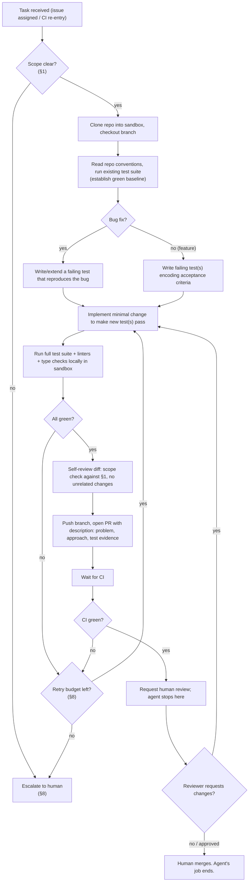

# Agent Design: Software Engineer Agent

## 0. Purpose & Provenance

This document specifies **one agent** produced by the agent factory described in `agent-factory-architecture.md` (hereafter "the factory doc"): a Claude Agent SDK-based agent whose job is building features and fixing bugs in a GitHub-hosted codebase. It is a *factory output*, not a factory redesign — every building-block choice below is inherited from the factory doc's §3.1–3.8 and cited by section number rather than re-argued. Where this agent's design needs a decision the factory doc does not make (e.g., which shell commands it may run), that gap is marked `[Assumption]` or `[Research]` per the same convention the factory doc uses.

**Assumptions fixed by the brief:**

| Assumption | Source |
|---|---|
| Model: Claude, invoked via Claude Agent SDK | User brief |
| Code host: GitHub (PRs, issues, CI checks) | User brief |
| This is one instance of the factory's output, not the factory itself | User brief |

## 1. Scope

### 1.1 What "feature" and "bug fix" mean for this agent

| Task type | Definition for this agent | Rationale |
|---|---|---|
| **Bug fix** | A behavior discrepancy between observed and specified/expected behavior, reproducible from an existing test, a failing CI check, or a written repro in the issue. The fix is scoped to the smallest diff that makes the discrepancy disappear without changing unrelated behavior. | `[Assumption]` Mirrors factory doc §1.1's framing that a factory output is a *bounded, versioned* unit of work, not an open-ended mandate — a bug fix agent that "improves things nearby" produces unreviewable diffs and breaks the Eval/Gating threshold in §3.6. |
| **Feature** | A net-new capability described in an issue/spec with explicit acceptance criteria (inputs, outputs, and at least one example of correct behavior). The agent implements against those criteria; it does not infer additional scope. | Same rationale — acceptance criteria are the per-task analogue of the factory-level spec artifact in §3.1; without them the agent has no eval target. |

### 1.2 Explicitly out of scope

| Out of scope | Why |
|---|---|
| Architecture-level redesign, dependency upgrades that touch build tooling, database migrations | Blast radius exceeds what sandbox testing (§3.3) can safely validate before a human sees it; these require human-led design review, not agent-led execution. |
| Security-sensitive changes (auth, secrets handling, permissions) without explicit human sign-off in the spec | `[Assumption]` Consistent with the factory doc's Eval/Gating layer treating human approval as first-class for high-risk promotions (§3.6, HumanLayer/gotoHuman) — the same posture applies one level down, at the level of an individual PR. |
| Production deploys, infra changes, credential rotation | Out of scope by construction — this agent's action surface is a sandboxed dev environment and the GitHub API only (§4). |
| Ambiguous tickets with no acceptance criteria and no reproducible symptom | Routed to escalation (§8), not attempted — an agent that guesses scope produces an eval-ungradeable PR. |
| Merging its own PRs, resolving its own review comments without a human re-approval pass, force-pushing over review history | Guardrail, not a capability gap — see §6. |

**Inputs/Outputs for this section:** Input: an issue or ticket. Output: a scope decision — "in scope, proceed" or "out of scope, escalate" — made before any code is touched.

## 2. Trigger

| Trigger | Mechanism | When used |
|---|---|---|
| **Issue assignment** | GitHub issue assigned to the agent's bot account (e.g., `@swe-agent`), or a label (`agent:pick-up`) applied to an existing issue | Default path. `[Assumption]` Reuses the factory doc's touchpoint layer (§3.1) — GitHub *is* the "existing chat surface" here, playing the role Slack/Teams plays for spec intake at the factory level, so no separate intake surface is introduced. |
| **Failing CI on an existing PR the agent authored** | Webhook from GitHub Actions (or equivalent) status check | Re-entry trigger during the workflow's self-correction loop (§5, §8) — not a new task, a continuation of one. |
| **Slack/chat command** (`/fix-bug <issue-url>`) | `[Assumption]` Optional secondary trigger, routed through the same Composio/Nango transport the factory doc names in §3.1 | Useful for ad hoc requests outside the issue tracker; not the primary path because it bypasses the issue as a durable, auditable spec artifact. |

**Rationale:** The factory doc's Spec/Intake layer (§3.1) separates transport (buyable) from schema/triage (assemble-only, differentiating). For this agent, the GitHub issue *is* the spec artifact — its title, body, labels, and linked acceptance criteria are the structured intake the factory doc describes generically. No new intake schema is invented; the issue template *is* the schema, and label-based triage (`agent:pick-up` vs. `needs-human`) *is* the accept/escalate policy from §3.1's third bullet, applied at task granularity instead of factory granularity.

**Inputs/Outputs:** Input: assignment event or webhook. Output: a task context object (issue body, linked PR if re-entry, CI status if re-entry) handed to the Build step.

## 3. Inputs

| Input | Source | Purpose |
|---|---|---|
| Issue/ticket body | GitHub Issues API | Primary spec: problem statement, acceptance criteria, reproduction steps |
| Linked design doc / RFC (if present) | GitHub, or the connector layer noted in §3.1 of the factory doc | Additional context for feature-shaped tickets |
| Repository contents (read) | Git clone into the execution sandbox (§3.3 of factory doc) | Ground truth for existing code, conventions, tests |
| Existing test suite | Same clone | Defines current expected behavior; test-first workflow (§5) depends on running this before touching code |
| CI configuration and recent run history | GitHub Actions API / CI provider API | Understand what gates a PR must pass; on re-entry, the specific failure signal to act on |
| CI logs on failure | GitHub Checks API | Root-cause input for the retry loop (§8) |
| Prior review comments (on re-entry) | GitHub PR review API | Required context to distinguish "new failure" from "reviewer asked for a change" |
| Repo-level agent policy file (e.g., `AGENTS.md` / `CLAUDE.md`-equivalent) | Repository root | `[Assumption]` Analogous to the factory doc's own use of CLAUDE.md-style project instructions — repo-specific conventions the agent must follow are declared once, in the repo, not re-specified per ticket. |

**Inputs/Outputs:** Input: everything above, assembled once per task invocation. Output: a bounded task context passed to the harness (§3.2 of factory doc) at Build time — no input source outside this table is consulted, which is itself a guardrail (§6).

## 4. Tool Access

### 4.1 Granted

| Tool / capability | Access level | Factory layer it maps to |
|---|---|---|
| Repo read (clone, file read, grep/search) | Full, within the assigned repo only | Execution Sandbox (§3.3) — sandboxed checkout, not a live working copy |
| Repo write (create branch, edit files, commit) | Full, restricted to a feature branch the agent creates; never to `main`/`master`/release branches | Execution Sandbox (§3.3) |
| Shell / test runner | Full, inside the sandbox only — build, run unit/integration tests, linters, formatters | Execution Sandbox (§3.3); Inference Routing (§3.4) governs any model calls made *during* tool use (e.g., a sub-call to summarize a stack trace) |
| GitHub API: create branch, push commits, open PR, comment on PR/issue, request review, respond to review comments | Scoped GitHub App / PAT with repo-write + PR-write, no admin scope | This is the agent's *action* surface; the equivalent of Harness Integration (§3.7 of factory doc) is the PR itself becoming the registrable, reviewable unit |
| CI status read | Read-only via Checks API | Feeds the self-verification step in §5 and the retry logic in §8 |
| Model inference | Routed through the factory's shared inference gateway | Inference Routing (§3.4) — this agent does not manage its own API keys or provider selection; that is inherited infrastructure, not built per-agent |
| Trace/log emission | Automatic, to the shared observability stack | Observability (§3.8) — every tool call and model call this agent makes is captured centrally, not logged ad hoc |

### 4.2 Explicitly NOT granted

| Withheld | Why |
|---|---|
| Push to `main`/protected branches; force-push anywhere | Guardrail — see §6 |
| Merge its own PR | Guardrail — human approval point, §6 |
| Production credentials, prod database access, prod infra API access | Out of scope by design (§1.2); sandbox has no network path to production per Execution Sandbox isolation (§3.3 of factory doc) |
| Ability to modify CI/CD pipeline definitions, branch protection rules, repo settings | These are governance surfaces, not code surfaces — changing them is an infra change, out of scope per §1.2 |
| Ability to install new third-party dependencies without flagging it in the PR description | `[Assumption]` Supply-chain risk control — a dependency add is a higher-blast-radius change than an in-repo edit and should be visible to the human reviewer as a flagged decision, not buried in a diff |
| Unrestricted internet access from the sandbox | `[Research]` Standard practice for coding agents (e.g., sandboxed CI runners); default-deny egress except to the package registry and the code host, to prevent both data exfiltration and supply-chain pull-in of unvetted code |
| Direct write access to the eval/observability store | It is a consumer of Observability (§3.8) and a subject of Eval/Gating (§3.6), not an operator of either — an agent that can edit its own eval traces can grade its own homework |

**Rationale:** The split mirrors the factory doc's own posture toward Execution Sandbox (§3.3): isolation dominates convenience, because a mis-scoped tool grant here compromises the codebase or the pipeline, not just one session. The one addition specific to this agent (vs. the factory doc's generic sandbox) is the GitHub API surface, which is this agent's only channel to affect anything outside the sandbox — and it is scoped to the same "propose, don't commit" shape as the rest of the pipeline (a PR is a proposal; a human or a required check merges it).

## 5. Workflow

**Step detail:**

1. **Task received → Scope check (§1).** Before any repo access, the agent evaluates whether the issue has a reproducible symptom (bug) or explicit acceptance criteria (feature). No scope, no start — this is the per-task equivalent of the factory's Spec Intake gate (§2 of factory doc): a spec that fails triage doesn't enter Build.
2. **Clone + baseline.** The agent checks out a fresh branch and runs the existing test suite *before* changing anything, to establish that failures introduced later are attributable to its own change, not pre-existing flakiness.
3. **Test-first.** For a bug, the agent writes a test that fails *for the same reason the bug report describes* — this is the verification that the agent understood the bug, not just that it wrote *a* test. For a feature, tests are written directly from the acceptance criteria before implementation.
4. **Implement minimally.** Changes are scoped to what makes the new test(s) pass; the self-review step (6) is what catches scope creep, but the instruction to implement minimally is the first line of defense.
5. **Local verification.** Full suite + lint + typecheck run inside the sandbox before anything is pushed — this is the agent's own gate, analogous to Sandbox Test (§3.3 of factory doc) but run by the agent on itself before the pipeline-level gate ever sees it.
6. **Self-review.** The agent diffs its own change against the original scope decision (§1) — flagging (and removing) any edit outside the stated problem. `[Assumption]` This step exists because LLM agents are observed to "fix things nearby" opportunistically; an explicit self-review pass is the cheapest guardrail against diff bloat, cheaper than relying on a human reviewer to catch it after the fact.
7. **Open PR.** The PR description states the problem, the approach, and the test evidence (which test failed before, passes now) — this is the artifact a human reviewer and the Eval/Gating layer (§3.6 of factory doc) both consume.
8. **CI wait + retry loop.** See §8 for the bounded-retry policy.
9. **Human review is a hard stop.** The agent does not merge, does not re-request its own review, and does not act further unless a human (or a required bot check acting as a delegate, e.g. a second review-bot) leaves actionable feedback — at which point it re-enters step 4 with the new context.

**Inputs/Outputs:** Input: task context (§3). Output: an open PR with passing CI and a clear description, in a state ready for human review — the workflow's terminal state is *always* "awaiting human," never "merged."

## 6. Guardrails

| Guardrail | Mechanism | Maps to |
|---|---|---|
| No push to protected branches | GitHub branch protection rules (repo-level, outside agent's control) + scoped token permissions | Deployment/Lifecycle (§3.7 of factory doc) — branch protection is this agent's analogue of "no agent reaches Deploy without a registry entry"; here, "no agent reaches `main` without a human-approved PR" |
| No force-push, no history rewrite on shared branches | Token scope excludes force-push; agent instructed never to rewrite pushed commits, only add new ones | Prevents destruction of review history mid-review |
| No merge authority | Token scope excludes merge; merge requires a human or a separately-gated auto-merge bot outside this agent's control | Human approval point — the single non-negotiable gate in this design |
| No production credentials, no prod network path | Sandbox network policy (§3.3 of factory doc); secrets scoped to CI/test fixtures only | Execution Sandbox isolation |
| Retry budget on CI failure | Bounded N (see §8), not unlimited | Prevents runaway compute cost and infinite loops; ties to factory doc's cost-per-run metric (§1.4) |
| Diff-size / scope ceiling | `[Assumption]` A soft limit (e.g., flag for human attention if diff exceeds ~400 lines or touches more than ~10 files) rather than a hard block, since some legitimate fixes are large | Keeps blast radius reviewable; a human decides whether an oversized diff is justified rather than the agent self-authorizing it |
| Dependency additions flagged, not silent | PR description must call out any new dependency | Supply-chain guardrail (§4.2) |
| All actions traced | Automatic emission to Observability (§3.8 of factory doc) | Every tool call, model call, and git operation is attributable after the fact — required for the incident-review path this agent will eventually need |
| Human sign-off required for security-sensitive scope | Enforced at the scope-check step (§1); such issues are routed to escalation, not attempted | Same posture as HumanLayer/gotoHuman-gated promotions at the factory level (§3.1, §3.6) |

**Rationale:** These guardrails collectively enforce a single invariant: **this agent can propose, but it cannot commit anything irreversible on its own authority.** Every irreversible or shared-state-affecting action (merge, force-push, branch-protection change, prod access) is either technically unreachable (no token scope) or requires a human in the loop. This is the same shape the factory doc uses for the factory's own promotion pipeline (Eval/Gate as a mandatory, not advisory, checkpoint — §1.4, §3.6) applied one level down to a single agent's day-to-day operation.

## 7. Success Criteria / Eval

| Criterion | Definition | Rationale |
|---|---|---|
| **Tests pass** | Full existing suite green, plus the new test(s) written for this task, both locally (agent's own gate) and in CI (pipeline gate) | Baseline correctness bar; two independent runs (sandbox + CI) catch environment-specific flakiness before a human sees the PR |
| **Lints/type checks clean** | No new lint or type errors introduced, per repo's existing tooling config | Consistency with repo conventions — the agent adapts to the repo's standard, it does not impose its own |
| **Scope matched** | Diff addresses only what the issue described; no unrelated refactors, renames, or "drive-by" fixes | Directly enforces §1's scope definition; checked by the agent's own self-review step (§5.6) and re-checked by the human reviewer |
| **PR is self-explanatory** | Description states problem, approach, and test evidence, without requiring the reviewer to reverse-engineer intent from the diff | `[Assumption]` A PR a human can't evaluate quickly is not "done" even if CI is green — review latency is part of the cost this agent is meant to reduce, not shift |
| **No guardrail violations** | No attempted push to protected branches, no scope creep past the diff-size ceiling without a flag, no undisclosed new dependency | Ties directly to §6 |
| **Reviewer accepts without major rework** | Proxy metric, measured after the fact: % of this agent's PRs approved with only minor/no comment rounds | `[Assumption]` Analogue of the factory doc's "Eval pass rate at the promotion gate" (§1.4) — first-pass acceptance rate is this agent's version of that metric, tracked over time via Observability (§3.8) |

**A PR is "done" — ready to hand to a human — when:** local test suite is green, CI is green, lint/typecheck are clean, the self-review step found no out-of-scope changes, and the PR description is complete. **A PR is "successful"** — the eval-level judgment, distinct from "done" — only after human merge, and that outcome (merged as-is / merged with changes / closed without merging) is the feedback signal fed back into Observability (§3.8) to track the reviewer-acceptance metric above over time.

**Inputs/Outputs:** Input: completed workflow state (§5) + CI results. Output: a merge/no-merge signal from the human, logged as an eval outcome for this agent's ongoing quality tracking — this is the per-agent instance of the factory-level Eval/Gating layer (§3.6 of factory doc), scored continuously rather than once at promotion time, since this agent (unlike a factory candidate) stays "in production" across many tasks.

## 8. Failure Handling

| Failure mode | Detection | Response |
|---|---|---|
| **Ambiguous ticket** (no reproducible symptom, no acceptance criteria) | Scope-check step (§5.1) fails to establish a testable target | Escalate immediately — comment on the issue asking for the specific missing information (repro steps / acceptance criteria), apply a `needs-clarification` label, do not open a branch or PR |
| **Ticket scope exceeds this agent's remit** (§1.2 out-of-scope categories) | Scope-check step matches an out-of-scope pattern (infra, migration, security without sign-off) | Escalate — comment explaining why, apply `needs-human` label, no code touched |
| **Stuck mid-implementation** (agent cannot make the new test pass after reasonable exploration) | `[Assumption]` Bounded attempt count within a single work session (e.g., N implementation attempts before declaring stuck) — exact N is a per-deployment tuning knob, not fixed by this design | Push whatever branch state exists (if any), open a draft PR or issue comment summarizing what was tried and why it didn't converge, tag for human pickup |
| **CI fails after the agent believes it fixed the issue** | CI webhook reports failure on agent-authored PR | Re-enter workflow at implementation step (§5.4) using the CI failure log as new input; this is a bounded retry, not a restart from scratch |
| **CI fails N times in a row on the same PR** | Retry counter maintained per-PR | Stop retrying at N (`[Assumption]` suggested default N=3, tunable per repo/team risk tolerance); convert the PR to draft or comment with a summary of what was attempted and the last failure signal, request human triage. This is the direct analogue of the factory doc's Eval/Gate failure loop (§2 of factory doc: "a failing score routes back to Build with the failure attached") but bounded, so a genuinely unfixable task doesn't consume unbounded compute |
| **Flaky test masks true CI status** | Same test fails/passes non-deterministically across retries with no code change | Do not count as a retry attempt against the agent's own fix; flag the flake explicitly to a human rather than silently re-running until green — silently retrying past flakiness would corrupt the reviewer-acceptance eval metric (§7) |
| **Reviewer requests changes agent disagrees with or can't parse** | Review comment doesn't map cleanly to an actionable diff | Ask a clarifying question on the PR rather than guessing; if no response within a reasonable window, remains open awaiting reviewer, does not self-resolve |
| **Agent's own action would violate a guardrail** (e.g., attempted push to protected branch is rejected by GitHub) | GitHub API error response | Treat as a hard stop, not a retry target — surface the rejection to a human immediately; a guardrail rejection signals a design assumption was wrong, not a transient failure to retry past |

**Rationale:** The overall shape is: *escalate before starting* when the task is ill-formed, *retry with a bound* when the task is well-formed but the fix isn't converging, and *stop hard, never retry around* when a guardrail itself is what's blocking progress. This keeps the agent's failure handling symmetric with the factory doc's own posture (§2, §3.6): a failure is only useful if it's actionable, so every escalation path attaches the specific signal (missing criteria, failure log, guardrail rejection) rather than a bare "couldn't do it."

## 9. Mapping Summary — This Agent's Build vs. Factory Layers

| Factory layer (factory doc §3.x) | Chosen block (factory doc) | This agent's use of it |
|---|---|---|
| Spec/Intake (§3.1) | Composio/Nango + Slack/Teams + HumanLayer/gotoHuman + bespoke schema | GitHub issue *is* the spec artifact; label/assignment *is* the triage rule (§2, §1) |
| Harness/Runtime (§3.2) | Claude Agent SDK | Runs this agent's plan → tool-call → observe loop end to end (§5) |
| Execution Sandbox (§3.3) | E2B | Isolated repo checkout, test/build/lint execution, no prod network path (§4) |
| Inference Routing (§3.4) | LiteLLM (self-hosted) | All model calls this agent makes are routed through the shared gateway — no agent-local key management |
| Orchestration/Durable Execution (§3.5) | Temporal | Sequences the multi-step workflow (§5) durably — a crash mid-retry-loop resumes rather than restarts |
| Eval/Gating (§3.6) | Braintrust + Langfuse | CI pass/fail + reviewer-acceptance rate (§7) are this agent's ongoing eval signal, distinct from the one-time promotion gate the factory doc describes for a *new* agent version |
| Deployment/Lifecycle (§3.7) | Git-backed registry | This agent itself is a registered, versioned entity in that registry; separately, each PR it opens is gated by branch protection — the same "no promotion without a registry/gate entry" shape, applied twice, at two different levels |
| Observability (§3.8) | Langfuse | Every tool call, model call, and git action traced; feeds the reviewer-acceptance metric (§7) and the retry-loop decision (§8) |

## 10. Open Questions / Assumptions Log

- `[Assumption]` Exact retry budget N (§8) and diff-size ceiling (§6) are deployment-tuned constants, not fixed by this design — a low-risk internal tool repo can tolerate a higher N and larger ceiling than a customer-facing production repo.
- `[Assumption]` This design assumes one agent per task, not a multi-agent swarm splitting a single ticket — consistent with the factory doc's own scope note (§4, Open Questions) that it targets single-organization internal use, not a more complex multi-tenant or multi-agent-per-task topology.
- `[Assumption]` The repo-level policy file (§3) assumes the target repo has (or will be given) such a file; a repo with no stated conventions falls back to matching the surrounding code's existing style, inferred from the sandbox checkout.
- `[Research]` Sandboxed coding-agent patterns with default-deny egress (§4.2) are consistent with common CI-runner and coding-agent security practice as of 2026, but no single named vendor product was checked against this specific agent's design — it is asserted by analogy to the factory doc's Execution Sandbox rationale (§3.3), not independently sourced.
- `[Assumption]` "Human review is a hard stop" (§5.9) assumes at least one human reviewer is available per repo within a reasonable SLA; if a repo has no active human reviewer, this design has no fallback — that gap is out of scope for this document and would need a separate escalation policy.
