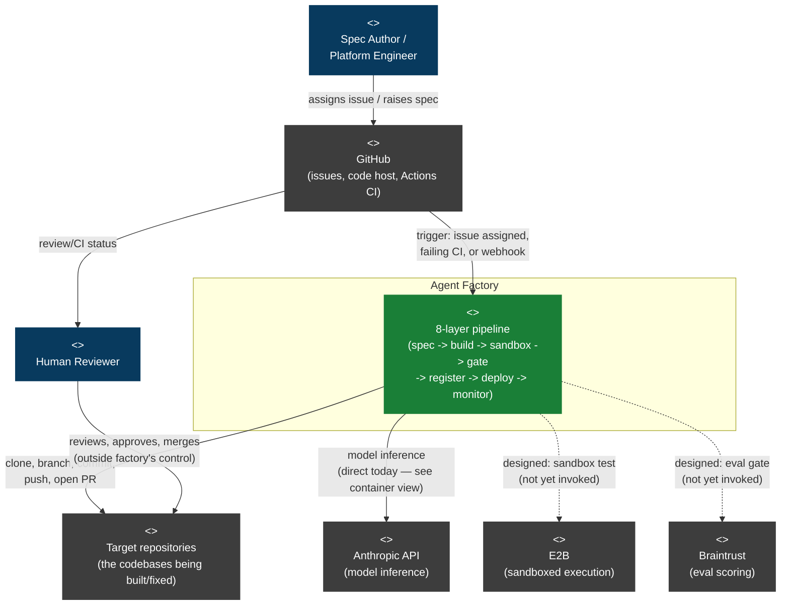

# C4 Level 1 — System Context

Who and what talks to the Agent Factory from outside its boundary. This
level is nearly identical between "designed" and "actual" — the boundary
itself hasn't shifted, only which internal edges are live has (see
[`20-c4-container.md`](./20-c4-container.md) for that split). Dashed edges
below mark integrations that are configured/built but never actually
called.

**Reading this diagram:**
- Solid edges are live today. Dashed edges (`core -.-> e2b`, `core -.-> braintrust`) are designed integrations with no calling code yet — see `00-status.md`.
- `targetrepo` (the codebase the factory builds/fixes) is drawn as external to the factory itself — it's the factory's actual work product, not part of it.
- The Human Reviewer is a first-class actor, not an edge case: per `agent-swe-design.md` §5/§6, the workflow's terminal state is always "awaiting human," never "merged" — the factory has no path that reaches `targetrepo`'s default branch without this actor.
