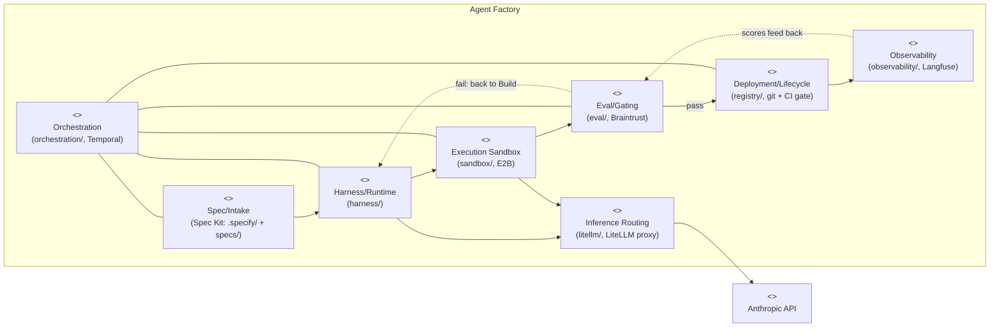
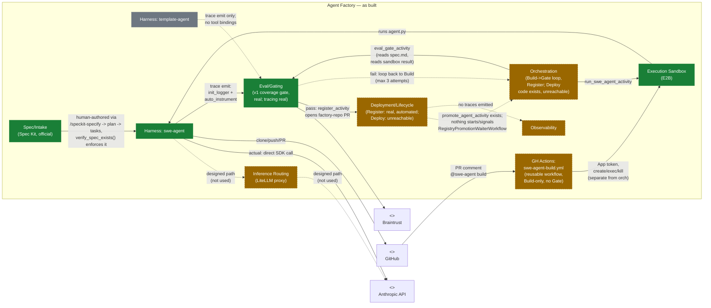

# C4 Level 2 — Containers

**Scope note:** "the 8 layers" below are the foundation tier
(`agent-factory-architecture.md` §1.1) — containers for building/shipping
agent workers, not the SDLC pipeline that runs them
(`docs/70-multi-agent-pipeline-design.md`), which has no container diagram
here yet.

Two diagrams, deliberately not one: collapsing "designed" and "as built"
into a single diagram at this granularity would either omit the LiteLLM
bypass or bury it in a footnote, and that bypass is one of the most
important facts in this repo right now.

## Diagram A — as designed (`agent-factory-architecture.md` §3.1–§3.8)

All 8 layers, full intended data flow. This diagram shows *intent*, not
status — every container is drawn solid, on purpose. The Spec/Intake box
reflects the *current* design (Spec Kit) — the original bespoke
schema/triage-policy design this box once meant is retired; see
`00-status.md`.

## Diagram B — as built (status-colored)

Same 8 containers; color and edge shape now reflect what actually runs.
**The LiteLLM edge is deliberately drawn twice** — the designed path
(dashed, through the proxy) and the actual path (solid, direct to
Anthropic) — because this single deviation contradicts a convention
`CLAUDE.md` states explicitly ("model calls never take a provider key
directly").

**Reading this diagram:** `orch → sandbox → harnessS` is the Temporal
path — Build now always runs inside E2B, never a host tempdir. The
GitHub-comment path (`github → ghTrigger → sandbox → harnessS`) is solid
but *independent* — it drives the same E2B template via its own `@e2b/cli`
calls, not through `orch`, and stops at Build with no Gate/Register/Deploy
of its own. `evalgate` is real for the Temporal path only (coverage gate,
same `BRAINTRUST_PROJECT` as tracing now — the earlier project-name split
is fixed) and feeds `registry`'s Register step, which really does open a
PR on pass. The `registry -.-> orch` edge marks the one genuine dead end:
`promote_agent_activity` and `RegistryPromotionWaiterWorkflow` are written
but nothing ever starts or signals the latter, so Deploy never executes.
See [`00-status.md`](./00-status.md) for the file-level evidence behind
each status color.
