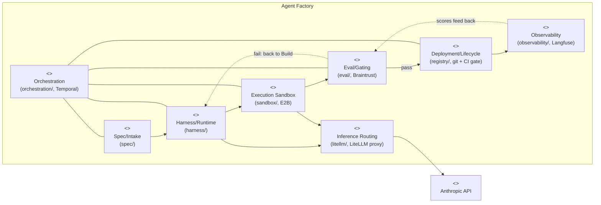
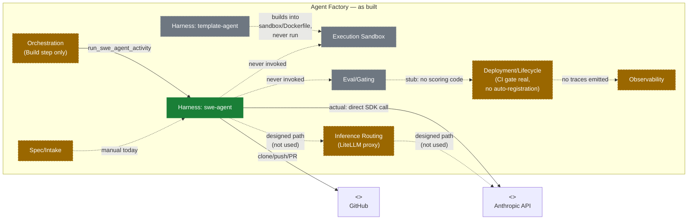

# C4 Level 2 — Containers

Two diagrams, deliberately not one: collapsing "designed" and "as built"
into a single diagram at this granularity would either omit the LiteLLM
bypass or bury it in a footnote, and that bypass is one of the most
important facts in this repo right now.

## Diagram A — as designed (`agent-factory-architecture.md` §3.1–§3.8)

All 8 layers, full intended data flow. This diagram shows *intent*, not
status — every container is drawn solid, on purpose.

## Diagram B — as built (status-colored)

Same 8 containers; color and edge shape now reflect what actually runs.
**The LiteLLM edge is deliberately drawn twice** — the designed path
(dashed, through the proxy) and the actual path (solid, direct to
Anthropic) — because this single deviation contradicts a convention
`CLAUDE.md` states explicitly ("model calls never take a provider key
directly").

**Reading this diagram:** the only solid, unconditional edges in the "as
built" view are `orch → harnessS`, `harnessS → anthropic` (direct), and
`harnessS → github`. Everything else is either manual, unused, or
one-directional-and-incomplete. See [`00-status.md`](./00-status.md) for
the file-level evidence behind each status color.
