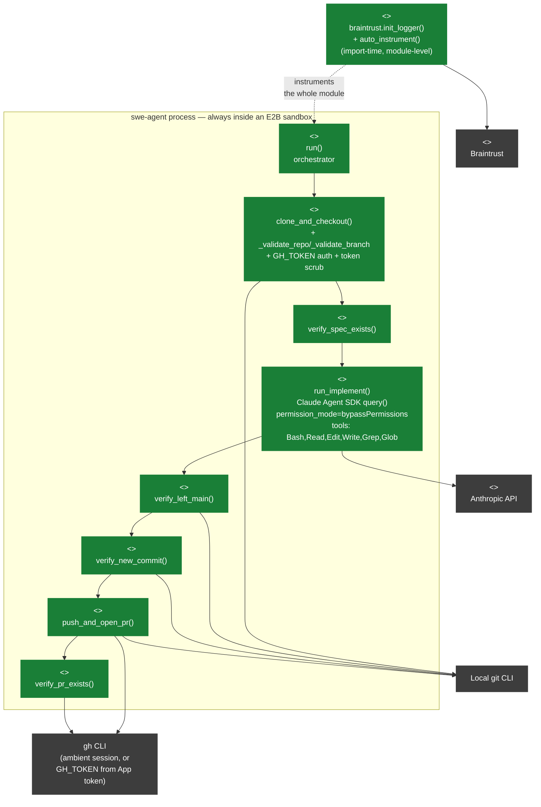

# C4 Level 3 — Components: `harness/swe-agent`

The only container in this repo worth decomposing to component level —
everything else is either an off-the-shelf service (Temporal, Langfuse) or
a stub with no internal structure yet. This maps directly onto
`harness/swe-agent/agent.py`'s functions, in the order `run()` actually
calls them. The same code now runs inside an E2B sandbox regardless of
which trigger started it — Temporal's `run_swe_agent_activity` or the
GitHub-comment path's `swe-agent-build.yml` (see
[`20-c4-container.md`](./20-c4-container.md)) — this diagram is agnostic to
which; only `clone_and_checkout()`'s auth path (`GH_TOKEN` source) differs
between them.

## Component notes

- **`clone_and_checkout()`** validates `repo`/`branch` against
  `_REPO_RE`/`_BRANCH_RE` before they reach `git`/`gh` argv — a guard
  against argument injection (e.g. a branch value like `--upload-pack=...`
  being parsed as a flag instead of a positional ref). Clones via an
  explicit `https://github.com/{repo}.git` URL rather than `gh repo clone`,
  because the latter defers to the host's `gh` `git_protocol` config, which
  may be set to `ssh` with no working key. `agent.py` itself still treats
  `GH_TOKEN` as optional (`os.environ.get`, falling back to an
  unauthenticated URL) for a hypothetical direct host-CLI invocation, but
  both real trigger paths now always supply it, since there's no ambient
  `gh` credential helper inside an E2B sandbox: `run_swe_agent_activity`
  requires it in the Temporal worker's own env (`os.environ["GH_TOKEN"]`,
  no fallback there) and forwards it into the sandbox; `swe-agent-build.yml`
  mints a fresh GitHub App installation token per run instead. When set,
  it's embedded as `x-access-token:{token}@github.com`. On a failed
  clone, `_scrubbed()` rebuilds the `CalledProcessError` with the token
  redacted from `args`/`cmd`/`output`/`stderr` before re-raising (`from
  None`, so the unscrubbed original doesn't survive in the traceback
  chain) — otherwise the token could leak into a workflow log or the PR
  comment the caller posts back.
- **`braintrust.init_logger()` / `auto_instrument()`** (module level, not
  inside `run()`) were added by the Braintrust setup wizard, then pointed
  at a shared `BRAINTRUST_PROJECT` env var (default `"agent-factory-pilot"`)
  instead of the wizard's `"My Project"` literal — they instrument the
  whole process for tracing, independent of the `run()` call chain below,
  and now land in the same project `eval/braintrust/eval.config.py`'s gate
  reads from — see `00-status.md`.
- **`verify_spec_exists()`** hard-fails if no `specs/*/tasks.md` is on the
  checked-out branch — this is the code-level enforcement that Spec Intake
  (`/speckit-specify → plan → tasks`) already happened upstream, manually,
  before this agent starts.
- **`run_implement()`** is the one component that calls out to the model.
  `permission_mode="bypassPermissions"` plus full `Bash` access means
  nothing tool-level stops the model from doing anything a human at a
  terminal could do inside the checkout — the surrounding
  `verify_left_main`/`verify_new_commit`/deterministic push-and-PR code is
  what actually enforces "propose, don't merge," not a permission grant.
  `setting_sources` is deliberately left at CLI defaults (not `[]`) because
  that's required for `/speckit-implement` to be discoverable at all — the
  accepted tradeoff is that a malicious branch's committed
  `.claude/settings.json` could contain an auto-executing hook, but this
  isn't a new risk layered on top of the already-unsandboxed, full-Bash
  "Known gap" documented in `harness/swe-agent/SKILL.md`.
- **`verify_left_main()` / `verify_new_commit()`** are the deterministic
  safety net around the model's own commit: the prompt tells the model to
  commit and stop (not push, not open a PR), and these two checks confirm
  it actually did — HEAD moved off `main`/`master`, and a new commit
  exists — before any push happens.
- **`push_and_open_pr()` / `verify_pr_exists()`** are the only components
  that touch the outside world beyond the clone. If `gh pr create` reports
  the PR already exists, that's treated as success (idempotent re-entry),
  not an error.
