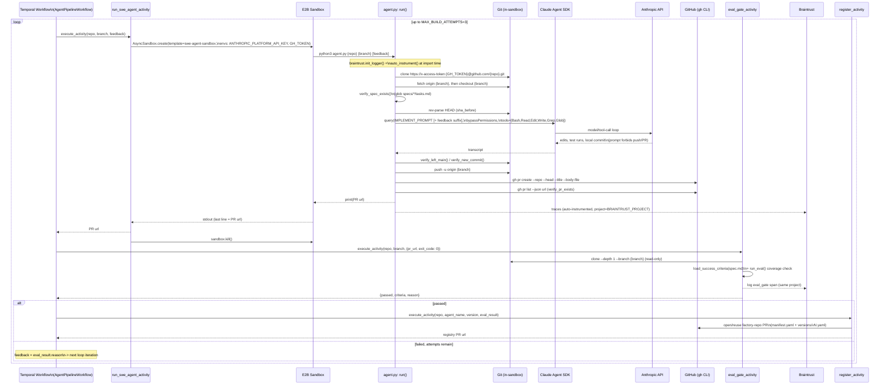

# Runtime sequence — `swe-agent`, as built

`agent-swe-design.md` §5 already diagrams the **designed** state machine
(test-first, self-review, CI-wait/retry loop, human-gate) as a flowchart —
that's the aspirational version, and this page doesn't redraw it. What
follows is a different, complementary view: an actor-lane sequence diagram
of the **actual code path**, traced directly from
`harness/swe-agent/agent.py`, `orchestration/activities.py`, and
`orchestration/workflows/pipeline_workflow.py`.

There are still **two trigger paths** into the same `agent.py:run()`, and
both now run it inside an E2B sandbox — the difference is what happens
around that call. This diagram traces the Temporal-triggered path, the
only one that continues past Build into Eval-Gate and Register. See
[`20-c4-container.md`](./20-c4-container.md) for how the second path — a
PR comment (`@swe-agent build`) driving
`.github/workflows/swe-agent-build.yml`, which mints a GitHub App token and
drives the same sandbox template via its own `@e2b/cli` calls — fits into
the container view; it stops after the equivalent of the `run_swe_agent_activity`
box below, with no Gate or Register step of its own.

Compared to the pre-orchestration-wiring version of this diagram, the
whole flow now runs inside `E2B` for the Temporal path too (no more host
tempdir), the sandbox call is wrapped in a Build→Gate retry loop, and a
passing gate genuinely opens a Register PR — `run_eval`/`load_success_criteria`
are real code now, not `NotImplementedError`. Deploy (`promote_agent_activity`
/ `RegistryPromotionWaiterWorkflow`) is deliberately not on this diagram:
nothing in the diagram above ever starts or signals that workflow.

## What's missing vs. the designed workflow

| Designed (`agent-swe-design.md` §5, §8)                                | Actual                                                                                                                                                                                                                                                                                                                                                                                          |
| ---------------------------------------------------------------------- | ----------------------------------------------------------------------------------------------------------------------------------------------------------------------------------------------------------------------------------------------------------------------------------------------------------------------------------------------------------------------------------------------- |
| Test-first: write a failing test before implementing                   | Not enforced by `agent.py` — delegated entirely to the model following `/speckit-implement`'s own conventions; no code-level check that a new test was added                                                                                                                                                                                                                                    |
| Local verification (full suite + lint + typecheck) as an explicit step | Folded into the model's own responsibility inside the `IMPLEMENT_PROMPT` turn — no separate `agent.py` step re-runs it afterward                                                                                                                                                                                                                                                                |
| Self-review diff against scope                                         | Not implemented — no scope-diff step exists between commit and push                                                                                                                                                                                                                                                                                                                             |
| Push branch, wait for CI, retry loop (§8, default N=3)                 | **Partially exists, but not for CI.** `pipeline_workflow.py` now loops Build→Eval-Gate up to `MAX_BUILD_ATTEMPTS=3`, feeding the gate's failure `reason` back into `agent.py` as a `feedback` argument appended to `IMPLEMENT_PROMPT`. This re-enters on a **failed Eval-Gate** (binary coverage check), not on a failing target-repo CI run — nothing polls the target repo's CI status at all |
| Reviewer-requests-changes re-entry                                     | Still not implemented — the agent's job ends at `verify_pr_exists()`; a human's PR review comment has no path back into `agent.py`                                                                                                                                                                                                                                                              |

The single most consequential remaining gap: **there is still no re-entry
path driven by the target repo's own CI or human review.** The new
Build→Gate loop only re-enters on the factory's own coverage check
(did a PR appear, did `spec.md` have criteria) — it never looks at the
target repo's actual CI status or a reviewer's comment. Per the design, a
failing CI check or a review comment should also route back into
implementation with that failure/comment as context; that mechanism still
doesn't exist.
