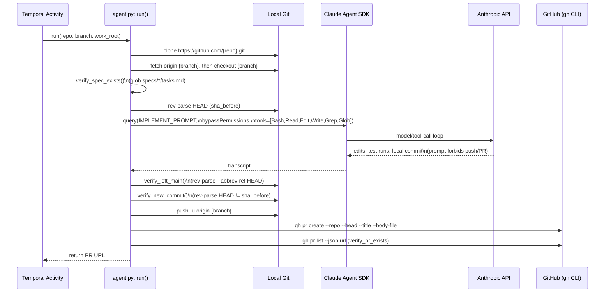

# Runtime sequence — `swe-agent`, as built

`agent-swe-design.md` §5 already diagrams the **designed** state machine
(test-first, self-review, CI-wait/retry loop, human-gate) as a flowchart —
that's the aspirational version, and this page doesn't redraw it. What
follows is a different, complementary view: an actor-lane sequence diagram
of the **actual code path**, traced directly from
`harness/swe-agent/agent.py`, `orchestration/activities.py`, and
`orchestration/workflows/pipeline_workflow.py`.

## What's missing vs. the designed workflow

| Designed (`agent-swe-design.md` §5, §8) | Actual |
|---|---|
| Test-first: write a failing test before implementing | Not enforced by `agent.py` — delegated entirely to the model following `/speckit-implement`'s own conventions; no code-level check that a new test was added |
| Local verification (full suite + lint + typecheck) as an explicit step | Folded into the model's own responsibility inside the `IMPLEMENT_PROMPT` turn — no separate `agent.py` step re-runs it afterward |
| Self-review diff against scope | Not implemented — no scope-diff step exists between commit and push |
| Push branch, wait for CI, retry loop (§8, default N=3) | **Does not exist.** `pipeline_workflow.py` sets `RetryPolicy(maximum_attempts=1)`; nothing in `agent.py` polls CI status or re-enters implementation on failure |
| Reviewer-requests-changes re-entry | Not implemented — the agent's job ends at `verify_pr_exists()` |

The single most consequential gap: **there is no re-entry path today.**
Per the design, a failing CI check or a review comment should route back
into the implementation step with that failure/comment as new context.
The current `agent.py`/`pipeline_workflow.py` pair has no mechanism to
receive that re-entry trigger at all — every run is a single, one-shot
attempt from clone to PR-open.
