# Pipeline flow — status-colored overlay

`agent-factory-architecture.md` §2 already draws the factory's 8-node
process flow (Spec Intake → Build → Sandbox Test → Eval/Gate → Harness
Integration → Deploy → Monitor → Retire/Version) — that diagram isn't
redrawn here. This page adds what it doesn't have: the same shape, with
each node and edge marked by what's actually automated today, so a new
contributor can see at a glance where to plug in next.

```mermaid
flowchart LR
    A["Spec Intake"]:::empty
    B["Build"]:::real
    C["Sandbox Test"]:::partial
    D{"Eval / Gate\n(tracing real,\nscoring stub)"}:::partial
    E["Harness Integration"]:::partial
    F["Deploy"]:::stub
    G["Monitor"]:::partial
    H{"Retire or Version?"}:::stub

    A -->|"manual: human writes\nspecs/NNN-slug/ via Spec Kit\n(unrelated to the now-deleted spec/ dir)"| B
    B -->|"Temporal activity\n(host tempdir, no sandbox)\nOR GitHub-comment trigger\n(E2B sandbox)"| C
    C -.->|"no activity defined —\nTemporal path skips this node;\nGH-comment path runs inside it\nbut still doesn't gate on it"| D
    D -.->|"scoring code still\nNotImplementedError —\nnothing can pass or fail here"| E
    D -.->|"fail loop: designed,\nunreachable (gate never runs)"| B
    E -->|"CI gate enforces\nmanifest shape (real)"| F
    E -.->|"no auto-registration\non pass"| F
    F -.->|"no deploy step exists"| G
    G -.->|"Langfuse infra up,\nzero traces flowing in\n(Braintrust tracing is separate,\nsee Eval/Gate)"| H
    H -.->|"no retirement/version\nlogic exists"| H

    classDef real fill:#1a7f37,stroke:#1a7f37,color:#fff
    classDef partial fill:#9a6700,stroke:#9a6700,color:#fff,stroke-dasharray: 4 3
    classDef stub fill:#6e7781,stroke:#6e7781,color:#fff,stroke-dasharray: 2 2
    classDef empty fill:#3d3d3d,stroke:#3d3d3d,color:#fff,stroke-dasharray: 1 4
```

## Node-by-node

- **Spec Intake — ⚪ empty.** `spec/` (schema, template, `triage-policy.md`)
  has been deleted from the working tree entirely — this predates the
  documentation pass that added this page. The actual accept/escalate
  decision was always made by a human anyway (the policy doc's own text
  said escalation routing was "not implemented in this scaffold yet"
  before it was deleted), so nothing about the *real* workflow changed —
  but the artifacts describing the intended policy are now gone, and
  `tests/test_agent_spec_schema.py` fails unconditionally as a result.
- **Build — 🟢 real.** The one fully automated, fully exercised node:
  `orchestration/workflows/pipeline_workflow.py` → `run_swe_agent_activity`
  → `harness/swe-agent/agent.py`. A second, independent entry point now
  exists too — a PR comment (`@swe-agent build`) driving
  `.github/workflows/swe-agent-build.yml` — see the Sandbox Test note
  below for how it changes what happens next.
- **Sandbox Test — 🟡 partial.** `sandbox/swe-agent/Dockerfile` +
  `e2b.toml` are real, proven end-to-end (commit `e505938`), and now
  actually invoked — but only by the GitHub-comment trigger path
  (`.github/workflows/swe-agent-build.yml` creates/execs/kills the E2B
  sandbox). The Temporal-triggered path still runs `swe-agent` in a host
  tempdir, bypassing this node entirely. Also: the sandbox image doesn't
  yet `pip install` the `braintrust` package `agent.py` now imports at
  module load — a GH-triggered run will `ImportError` until the
  `Dockerfile` is updated and the image rebuilt.
- **Eval/Gate — 🟡 partial.** `eval/braintrust/eval.config.py`'s
  `load_success_criteria` and `run_eval` both still unconditionally
  `raise NotImplementedError` — there is no code path by which a candidate
  could pass *or* fail the actual gate. Separately, both `agent.py` files
  now call `braintrust.init_logger()` + `auto_instrument()` at import
  time (added by the Braintrust setup wizard), so traces *are* flowing to
  Braintrust — just to a project (`"My Project"`) different from the one
  `eval.config.py` targets (`"agent-factory-pilot"`), and not consumed by
  any gating logic.
- **Harness Integration — 🟡 partial.** `registry-gate.yml` is real CI: it
  blocks any PR touching `registry/**`/`spec/**` unless every agent
  directory has a `manifest.yaml` and non-empty `versions/`. But nothing
  automatically creates or updates a registry entry when a build passes —
  `registry/agents/swe-agent/` was added by hand, once.
- **Deploy — ⚪ stub.** No deploy step, canary, or staged rollout exists
  anywhere in the repo for an agent itself (the pipeline's own CI/CD is a
  separate concern from deploying a *produced* agent).
- **Monitor — 🟡 partial.** Langfuse and its Postgres/ClickHouse backing
  run via the root `docker-compose.yml`. No code in `harness/swe-agent` or
  `orchestration/` emits a trace to it.
- **Retire or Version — ⚪ stub.** No decision logic, scheduled review, or
  retirement mechanism exists.

See [`60-best-practices.md`](./60-best-practices.md) for what "done" looks
like for each stub/partial node above.
