# Pipeline flow — status-colored overlay

`agent-factory-architecture.md` §2 already draws the factory's 8-node
process flow (Spec Intake → Build → Sandbox Test → Eval/Gate → Harness
Integration → Deploy → Monitor → Retire/Version) — that diagram isn't
redrawn here. This page adds what it doesn't have: the same shape, with
each node and edge marked by what's actually automated today, so a new
contributor can see at a glance where to plug in next.

```mermaid
flowchart LR
    A["Spec Intake"]:::partial
    B["Build"]:::real
    C["Sandbox Test"]:::stub
    D{"Eval / Gate"}:::stub
    E["Harness Integration"]:::partial
    F["Deploy"]:::stub
    G["Monitor"]:::partial
    H{"Retire or Version?"}:::stub

    A -->|"manual: human writes\nspecs/NNN-slug/ via Spec Kit"| B
    B -->|"Temporal activity\nrun_swe_agent_activity"| C
    C -.->|"no activity defined"| D
    D -.->|"no scoring code —\nnothing can pass or fail here"| E
    D -.->|"fail loop: designed,\nunreachable (gate never runs)"| B
    E -->|"CI gate enforces\nmanifest shape (real)"| F
    E -.->|"no auto-registration\non pass"| F
    F -.->|"no deploy step exists"| G
    G -.->|"Langfuse infra up,\nzero traces flowing in"| H
    H -.->|"no retirement/version\nlogic exists"| H

    classDef real fill:#1a7f37,stroke:#1a7f37,color:#fff
    classDef partial fill:#9a6700,stroke:#9a6700,color:#fff,stroke-dasharray: 4 3
    classDef stub fill:#6e7781,stroke:#6e7781,color:#fff,stroke-dasharray: 2 2
```

## Node-by-node

- **Spec Intake — 🟡 partial.** Schema and triage policy are fully written
  (`spec/schema/agent-spec.schema.json`, `spec/triage-policy.md`); the
  actual accept/escalate decision is made by a human, not the policy engine
  the policy doc describes (its own text: escalation routing "not
  implemented in this scaffold yet").
- **Build — 🟢 real.** The one fully automated, fully exercised node:
  `orchestration/workflows/pipeline_workflow.py` → `run_swe_agent_activity`
  → `harness/swe-agent/agent.py`.
- **Sandbox Test — ⚪ stub.** `sandbox/Dockerfile` + `e2b.toml` exist and
  build an image — for `template-agent`, not `swe-agent` — and nothing in
  the workflow ever invokes E2B. `swe-agent` runs in a host tempdir instead.
- **Eval/Gate — ⚪ stub.** `eval/braintrust/eval.config.py`'s
  `load_success_criteria` and `run_eval` both unconditionally
  `raise NotImplementedError`. There is no code path by which a candidate
  could pass *or* fail this gate — it simply isn't run.
- **Harness Integration — 🟡 partial.** `registry-gate.yml` is real CI: it
  blocks any PR touching `registry/**`/`spec/**` unless every agent
  directory has a `manifest.yaml` and non-empty `versions/`. But nothing
  automatically creates or updates a registry entry when a build passes —
  `registry/agents/swe-agent/` was added by hand, once.
- **Deploy — ⚪ stub.** No deploy step, canary, or staged rollout exists
  anywhere in the repo for an agent itself (the pipeline's own CI/CD is a
  separate concern from deploying a *produced* agent).
- **Monitor — 🟡 partial.** Langfuse and its Postgres/ClickHouse backing
  run via the root `docker-compose.yml`. No code in `harness/swe-agent` or
  `orchestration/` emits a trace to it.
- **Retire or Version — ⚪ stub.** No decision logic, scheduled review, or
  retirement mechanism exists.

See [`60-best-practices.md`](./60-best-practices.md) for what "done" looks
like for each stub/partial node above.
