# Pipeline flow — status-colored overlay

`agent-factory-architecture.md` §2 already draws the factory's 8-node
process flow (Spec Intake → Build → Sandbox Test → Eval/Gate → Harness
Integration → Deploy → Monitor → Retire/Version) — that diagram isn't
redrawn here. This page adds what it doesn't have: the same shape, with
each node and edge marked by what's actually automated today, so a new
contributor can see at a glance where to plug in next.

```mermaid
flowchart LR
    A["Spec Intake\n(Spec Kit)"]:::real
    B["Build"]:::real
    C["Sandbox Test"]:::real
    D{"Eval / Gate\n(v1 coverage gate,\nreal)"}:::real
    E["Register"]:::real
    F["Deploy"]:::partial
    G["Monitor"]:::partial
    H{"Retire or Version?"}:::stub

    A -->|"human writes specs/NNN-slug/\nvia Spec Kit — official flow;\nenforced by verify_spec_exists()"| B
    B -->|"Temporal AgentPipelineWorkflow\nOR GitHub-comment trigger\n— both now run inside E2B"| C
    C -->|"Temporal path only:\nrun_swe_agent_activity's PR url\nfeeds eval_gate_activity"| D
    D -->|"pass: register_activity\nopens factory-repo PR"| E
    D -.->|"fail loop: real,\nup to MAX_BUILD_ATTEMPTS=3,\nfeedback -> next Build"| B
    E -.->|"promote_agent_activity exists,\nbut nothing starts/signals\nRegistryPromotionWaiterWorkflow"| F
    F -.->|"no deploy step exists"| G
    G -.->|"Langfuse infra up,\nzero traces flowing in\n(Braintrust tracing is separate,\nsee Eval/Gate)"| H
    H -.->|"no retirement/version\nlogic exists"| H

    classDef real fill:#1a7f37,stroke:#1a7f37,color:#fff
    classDef partial fill:#9a6700,stroke:#9a6700,color:#fff,stroke-dasharray: 4 3
    classDef stub fill:#6e7781,stroke:#6e7781,color:#fff,stroke-dasharray: 2 2
    classDef empty fill:#3d3d3d,stroke:#3d3d3d,color:#fff,stroke-dasharray: 1 4
```

**Note:** the GitHub-comment trigger path is Build-only — it has no Gate,
Register, or Deploy step. The graph above traces the Temporal path, the
only one that reaches past Sandbox Test.

## Node-by-node

- **Spec Intake — 🟢 real (Spec Kit, human-authored by design).**
  GitHub Spec Kit (`/speckit-specify` → `/speckit-plan` → `/speckit-tasks`,
  producing `specs/NNN-slug/`) is the official, only supported intake flow
  — enforced at runtime by `swe-agent`'s `verify_spec_exists()`. The old
  bespoke `spec/` (schema, template, `triage-policy.md`) is retired, not a
  gap to restore; nothing about the real workflow needs it back.
  `tests/test_agent_spec_schema.py` still tests the deleted schema and
  fails unconditionally — cleanup candidate, pending deletion.
- **Build — 🟢 real.** `orchestration/workflows/pipeline_workflow.py`'s
  `AgentPipelineWorkflow` → `run_swe_agent_activity` → `harness/swe-agent/agent.py`,
  now inside an E2B sandbox (`AsyncSandbox.create`/`.commands.run`/`.kill`).
  A second, independent entry point still exists — a PR comment
  (`@swe-agent build`) driving `.github/workflows/swe-agent-build.yml`,
  which also runs sandboxed but stops after this node (no Gate/Register).
- **Sandbox Test — 🟢 real.** `sandbox/swe-agent/Dockerfile` + `e2b.toml`
  are proven end-to-end (commit `e505938`) and now `pip install` both
  `claude-agent-sdk` and `braintrust>=0.36.0` — the earlier missing-dependency
  `ImportError` gap is fixed. Collapsed into the Build activity rather than
  a separate one, per `registry/agents/swe-agent/versions/v1.yaml`.
- **Eval/Gate — 🟢 real (coverage gate, not semantic scoring).**
  `eval/braintrust/eval.config.py::run_eval` parses `- **SC-NNN**: ...`
  bullets from the branch's `specs/*/spec.md` and passes iff the sandbox
  exited 0, a PR url exists, and at least one criterion was found —
  content of each criterion is not verified. `orchestration/activities.py::eval_gate_activity`
  clones the branch read-only to reach `spec.md` and is retried up to 4
  times on transient failure. On fail, `pipeline_workflow.py` loops back to
  Build (up to `MAX_BUILD_ATTEMPTS=3`) with the gate's `reason` as feedback.
  Braintrust tracing (`agent.py`'s `init_logger`/`auto_instrument`) and the
  gate now share one project (`BRAINTRUST_PROJECT`, default
  `"agent-factory-pilot"`) — the earlier project-name split is fixed.
- **Register — 🟢 real.** `register_activity` opens a PR against this
  factory repo writing/updating `registry/agents/<name>/manifest.yaml` and
  `versions/<version>.yaml` from the real `eval_gate_activity` result,
  reusing an already-open PR on retry instead of stacking duplicates.
  `registry-gate.yml` (CI) still separately enforces the directory-shape
  invariant on any PR touching `registry/**`.
- **Deploy — 🟡 partial (code exists, unreachable).** `promote_agent_activity`
  flips `manifest.yaml.status` to `active` via another factory-repo PR, and
  `RegistryPromotionWaiterWorkflow` waits on a `pr_merged` signal to run
  it — but nothing in this repo ever starts that workflow or sends that
  signal (no GH Actions step, webhook, or CLI does it). Functionally this
  node still never fires.
- **Monitor — 🟡 partial.** Langfuse and its Postgres/ClickHouse backing
  run via the root `docker-compose.yml`. No code in `harness/swe-agent` or
  `orchestration/` emits a trace to it (Braintrust tracing is a separate
  service, feeding Eval/Gate above, not Langfuse).
- **Retire or Version — ⚪ stub.** No decision logic, scheduled review, or
  retirement mechanism exists.

See [`60-best-practices.md`](./60-best-practices.md) for what "done" looks
like for each stub/partial node above.
