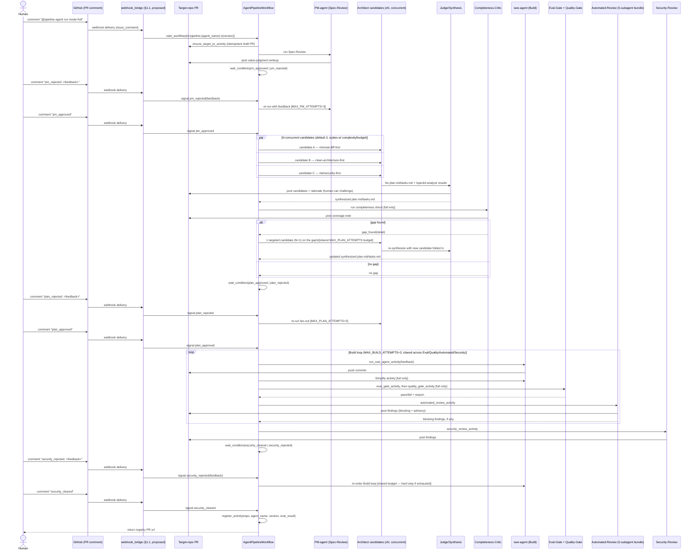
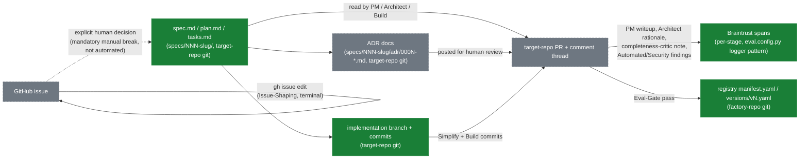

# Multi-agent SDLC pipeline — design proposal

**Status: design only.** Nothing in this document is implemented.
`orchestration/workflows/pipeline_workflow.py`'s `AgentPipelineWorkflow` today
still only sequences Build (§3.2) → Eval-Gate (§3.6) → Register (§3.7), exactly
as `00-status.md` and `50-pipeline-flow-gap-analysis.md` describe it. This
page proposes extending that workflow into a full multi-stage SDLC pipeline —
PM review, architecture/plan review, build, cleanup, automated code review,
security review, human approval gates, register, deploy — and stays at the
Orchestration layer (§3.5): every new stage below is a sibling of Build inside
the same pipeline-level sequencing, not a reopening of `agent-swe-design.md`
§10's single-agent-per-task scope. No code changes accompany this doc.

## 1. Entry points

Two independent starting points exist, on purpose, with a **mandatory manual
break between them** — the second never fires automatically from the first.

| Entry point | Trigger | Scope | Temporal entry? |
|---|---|---|---|
| **PM-agent Issue-Shaping** | `@pm-agent shape` comment on a raw, unshaped GitHub **issue** (no PR, no branch, no spec) | Rewrites/clarifies the issue in place (`gh issue edit`) — adds scope clarity, an explicit value-judgment note, no-gold-plating flags | **No.** Terminal at the issue. |
| **Pipeline run** | `@pipeline-agent run mode=<full\|vibe>` comment on the target-repo PR (mirrors `swe-agent-build.yml`'s `@swe-agent build` comment trigger and its author-association gate) — **not** a developer typing a Python call. See §1.1 for the actual GitHub-to-Temporal path | Everything from §4 onward below | Yes — this is the workflow this doc extends |

**Gap, same class as the DeployWaiter gap (§2/§9):** `orchestration/worker.py`
only registers `AgentPipelineWorkflow` — nothing in this repo starts or
signals it today (no CLI, no script, no GH Actions step, no webhook
receiver). A developer's only real interfaces to this repo are GitHub
(issue/PR comments, `gh` CLI) or the GitHub Web UI — never a direct Temporal
SDK call. §1.1 specifies the proposed fix; every `AgentPipelineWorkflow.run(...)`
or `.signal(...)` reference below denotes the internal Temporal API that
fix would call, not something a human invokes by hand.

### 1.1 Trigger bridge — the actual interface (proposed, not built)

A GitHub event can only ever reach Temporal one of two general ways, and
today **neither exists**:

- **CI-hook** — a GH Actions workflow (the same shape as the existing
  `swe-agent-build.yml`/`swe-agent-trigger.yml` comment-trigger pair) whose
  runner calls out to Temporal.
- **Webhook/API server** — a persistent process GitHub calls directly,
  which in turn calls Temporal.

This doc adopts the **webhook/API server**, for a reason specific to this
repo's actual deployment: `docker-compose.yml`'s `temporal` service is
`7233:7233` on a bare `docker compose up` — no TLS, no auth, reachable only
from the machine running it (today, a developer's laptop). GitHub-hosted
Actions runners cannot reach that as configured, so a CI-hook would
additionally need either a self-hosted runner co-located on that same
machine/network, or exposing Temporal's unauthenticated control plane
publicly — both real infra changes, and worse than running one new local
server. A webhook server needs no such exposure: it runs on the same
machine as `make up`, talks to Temporal exactly as `orchestration/worker.py`
already does, and only needs its own HTTP endpoint reachable from GitHub —
which is the normal shape of a GitHub App webhook anyway. It also handles
both the initial start *and* every later signal (`pm_approved`,
`plan_rejected`, `security_cleared`, etc.) as the same kind of event, since
a CI-hook would hit the identical Temporal-unreachability problem again on
every single signal, not just the first run.

**New component: `orchestration/webhook_bridge/`.**

- **Transport** — reuses the existing `swe-agent` GitHub App
  (`SWE_AGENT_APP_ID`/`SWE_AGENT_APP_PRIVATE_KEY`) rather than registering a
  second one: add a webhook URL and subscribe it to `issue_comment`
  (created) deliveries. A new secret, `GH_WEBHOOK_SECRET`, verifies each
  delivery's `X-Hub-Signature-256` HMAC before anything else runs. This is
  a framing shift for that App, not just a config tweak: today it's only
  ever used inside Actions to mint a short-lived installation token
  (`swe-agent-build.yml`); this bridge is what turns it into a genuine,
  full GitHub App — a persistent server subscribed to webhooks and acting
  on deliveries on its own, same App identity, no second App registered.
- **Authorization** — re-implements in code the same allowlist
  `swe-agent-build.yml`'s `if:` enforces today (`author_association` in
  `["OWNER", "MEMBER", "COLLABORATOR"]`) — there's no GH Actions `if:` to
  lean on once this is off Actions.
- **Grammar** (mirrors the `@swe-agent build` comment-command precedent):
  - `@pipeline-agent run mode=<full|vibe>`, not yet running for this PR →
    `client.start_workflow(AgentPipelineWorkflow.run, args=(repo, branch,
    agent_name, version, mode), id=f"pipeline-{agent_name}-v{version}")`
    (the deterministic ID §6 proposes).
  - `pm_approved` / `pm_rejected: <feedback>` / `plan_approved` /
    `plan_rejected: <feedback>` / `security_cleared` /
    `security_rejected: <feedback>`, already running →
    `client.get_workflow_handle(same id).signal(...)`.
  - How `agent_name`/`version` get resolved from a PR comment or branch is
    left as an open question (§9), not decided here.
- **Network** — runs on the same host as `make up` (today: the laptop) and
  connects to Temporal exactly as `orchestration/worker.py` does
  (`Client.connect("localhost:7233")`); Temporal's own exposure is
  unchanged.
- **Local-dev reachability** — a laptop has no public IP for GitHub to
  deliver webhooks to. Decided: `smee-client` (npm package, GitHub's own
  recommended relay for local App dev) relays deliveries from a
  `smee.io/<channel>` proxy to the bridge's local port. The channel URL
  lives in one place, a `WEBHOOK_PROXY_URL` env var (the convention GitHub
  App templates use), read by both `smee-client`
  (`npx smee-client --url "$WEBHOOK_PROXY_URL" --target
  http://localhost:<port>/webhook`) and the bridge itself — not hardcoded
  at either call site. The bridge server is still not built; only the
  relay leg is ready. A `make bridge` target (proposed) would run relay +
  server together.

Between these two, a human must **explicitly decide** to turn a shaped issue
into `specs/NNN-slug/spec.md` — today, still manually, via `/speckit-specify`
→ `/speckit-plan` → `/speckit-tasks`, per `CLAUDE.md`'s documented Spec Kit
flow. PM-agent's Issue-Shaping job does not call `/speckit-specify`, does not
create a branch, and never touches the pipeline — this is a deliberate scope
boundary, not an oversight: turning a customer ask into a formal spec is a
judgment call a human keeps.

Issue-Shaping mirrors `swe-agent-build.yml`'s authorization gate
(`github.event.comment.author_association` in `["OWNER", "MEMBER",
"COLLABORATOR"]`, per `.github/workflows/swe-agent-build.yml`), but keyed off
an **issue** comment with no linked PR (`github.event.issue.pull_request ==
null`) instead of a PR comment. Its tool access is deliberately narrow: `gh
issue` only — no `Bash`, no git, no Spec Kit tools at all — so it structurally
cannot create a branch or a spec even if instructed to.

## 2. Stage roster

**Existing, unchanged:**

| Stage | Activity | Notes |
|---|---|---|
| Build | `run_swe_agent_activity` | Collapses Build + Sandbox Test (§3.2+§3.3), runs in the E2B `swe-agent-sandbox` template |
| Eval-Gate | `eval_gate_activity` | v1 binary coverage gate (`eval/braintrust/eval.config.py::run_eval`) |
| Register | `register_activity` | Opens a factory-repo PR writing `manifest.yaml`/`versions/vN.yaml` |
| Deploy waiter | `RegistryPromotionWaiterWorkflow` | Separate long-lived workflow, waits on `pr_merged` — **still unreachable today**, a pre-existing tracked gap (`00-status.md`), not something this proposal fixes |

**New:**

| Stage | Wraps | Blocking? |
|---|---|---|
| `ensure_target_pr_activity` | New — mirrors `activities.py::_open_factory_pr`'s idempotent existing-PR check, against the **target** repo instead of the factory repo | N/A — setup step |
| PM Spec-Review | New `pm-agent` (Spec-Review job) | Blocking human gate (`full`); auto-proceeds (`vibe`) |
| Architect | New `architect-agent`, N concurrent candidates (default 3, scales with spec complexity/budget — see §2's Architect subsection) + 1 judge/synthesis | Blocking human gate (`full`); auto-proceeds once `/speckit-analyze` passes or budget exhausted (`vibe`) |
| Completeness-Critic | New activity, single critic pass over judge's synthesized plan | Non-blocking gate-of-its-own; can trigger one bounded extra candidate (`full` only, see §2) — **skipped entirely** in `vibe` |
| Simplify | `code-simplifier:code-simplifier` (Anthropic plugin agent — not the `pr-review-toolkit:code-simplifier` variant) | Never blocking; skipped entirely in `vibe` |
| Quality-Gate | New activity, extends `load_success_criteria`'s parsing pattern | Blocking in `full`; **skipped entirely** in `vibe` |
| Automated-Review | `pr-review-toolkit:review-pr`'s 5-subagent bundle | `code-reviewer` + `silent-failure-hunter` blocking in `full` (all advisory in `vibe`); `comment-analyzer` + `pr-test-analyzer` + `type-design-analyzer` always advisory |
| Security-Review | `security-review` skill | **Always blocking, in both modes** — a safety control, not a speed/quality tradeoff |

**Explicitly not recommended as new stages** (and why):

- **Standalone QA/test-writer** — redundant with `swe-agent`'s own test-first
  mandate (`agent-swe-design.md` §5 steps 3–4) and with the advisory
  `pr-test-analyzer`.
- **Standalone docs/changelog updater** — redundant with `versions/vN.yaml`
  (§3.7) plus extending `register_activity`'s existing PR body; no new stage
  needed.

### PM-agent — two decoupled jobs

Documented as one stage, two subsections, because they run at different
times, on different artifacts, with different tool access — collapsing them
into one job would blur the mandatory manual break in §1:

- **Issue-Shaping** — see §1. Terminal at the issue. Tool access: `gh issue`
  only.
- **Spec-Review + PM-Approval-Gate** — runs once `spec.md` already exists on
  the branch (created by a human, whether or not that human started from a
  PM-agent-shaped issue). Produces a value-judgment writeup — "is this the
  right thing, built right," explicit no-gold-plating check — posted to the
  target-repo PR thread. Gated by `pm_approved`/`pm_rejected`. Tool access
  includes read-only `/speckit-analyze`-style inspection but **no git-push** —
  mirrors `swe-agent`'s own "push only after verification steps run in code,
  not left to the model" guardrail (`registry/agents/swe-agent/SKILL.md`,
  "Known gap").

New registry entry `registry/agents/pm-agent/` (own `manifest.yaml`/
`SKILL.md`, same pattern as `registry/agents/swe-agent/`), own harness.

### Architect-agent — judge-panel, not single-answer

Architecture is not a single-answer problem, so this stage fans out instead of
producing one plan directly:

1. **N candidate architects run concurrently** — plain concurrent activities
   inside the same workflow execution (Temporal activities already run
   concurrently when awaited together; no child workflow needed), each
   producing an independent `plan.md`/`tasks.md`/ADR set for the same
   `spec.md`, prompted from a distinct angle. `N` defaults to 3
   (minimal-diff-first, clean-architecture-first, risk/security-first) but is
   a tunable knob, not a hardcoded constant: it scales up for specs with more
   `SC-NNN` criteria or a larger token budget (mirroring the
   `budget.total`-scaled fan-out pattern used elsewhere for agent fleets —
   e.g. `Math.floor(budget.total / per-candidate-cost)`), and `vibe` mode
   already collapses it to 1 (§4). Because a candidate's only output is
   text/markdown (`plan.md`/`tasks.md`/ADRs), never executed code, each
   candidate runs as a plain Claude Agent SDK call — **no E2B sandbox
   provisioned per candidate**, unlike Build (§6.1's carve-out).
2. **1 judge/synthesis activity** scores all N against `spec.md`'s `SC-NNN`
   criteria, each candidate's own `/speckit-analyze` consistency result, and
   the same no-gold-plating principle PM-agent applies — then produces a
   **single synthesized** `plan.md`/`tasks.md`, picking a winner and grafting
   strong ideas from runners-up. Same as the candidates, this is a plain
   agent call, no sandbox.
3. **1 completeness-critic activity** runs next, before the human gate: a
   single fresh-context agent (again no sandbox — it only reads text) that
   asks "what's missing" — is every `SC-NNN` criterion actually addressed by
   the synthesized plan, is there an architectural angle none of the N
   candidates tried, is there an edge case the spec implies but no candidate
   touched. This exists because a fixed-angle fan-out only ever explores the
   angles it was prompted with; the critic is the check that the panel's
   coverage was actually adequate, not just diverse-looking.
   - **No gap found** — critic posts a short "coverage checked, none found"
     note to the PR thread and the synthesized plan proceeds straight to the
     human `plan_approved`/`plan_rejected` gate, unchanged.
   - **Gap found** — critic's finding (a specific missing angle or
     uncovered `SC-NNN`) is fed back as the prompt for exactly **one**
     additional targeted candidate (re-entering step 1 with `N=1`, angle =
     the critic's finding), then judge/synthesis re-runs to fold it in
     before reaching the human gate. This extra round counts against the
     same `MAX_PLAN_ATTEMPTS=3` budget as an ordinary `plan_rejected` loop —
     it is not a separate, unbounded budget — so at most one such
     gap-driven round can happen before the attempts are exhausted by
     human-reject loops alone.
   - Skipped entirely in `vibe` (§4) — `vibe` already runs a single architect
     with no panel to check the coverage of.
4. The bounded autonomous-repair loop (`MAX_PLAN_ATTEMPTS=3`, re-invoking
   `/speckit-plan` on the synthesized result) and the single human
   `plan_approved`/`plan_rejected` gate apply to this **one synthesized
   plan**, not to each candidate — Build still consumes exactly one
   `tasks.md`, unchanged.
5. Candidate plans + judge rationale + the critic's note are posted to the
   target-repo PR thread (so the human gate can *challenge* the automated
   pick) and logged as Braintrust spans; only the synthesized plan is
   committed to `specs/NNN-slug/` — candidates are not committed clutter.

A reject at the human gate re-enters the bounded re-plan loop once more (can
request a specific candidate's approach instead of the judge's pick), then
escalates if still rejected.

### Quality-Gate

New activity, positioned right after Eval-Gate, in the same "objective
measurable threshold" family — extends the `SC-NNN` parsing pattern
`eval.config.py::load_success_criteria` already implements rather than
inventing a parallel mechanism. Enforces three concrete, blocking attributes:

1. **Traceability** — every `SC-NNN` bullet parsed from `spec.md`'s
   `### Measurable Outcomes` must be referenced at least once in the diff
   (test name, docstring, or commit message).
2. **Documentation** — every new/changed public function/class has a
   docstring; any diff touching `orchestration/`, `harness/`, or introducing a
   new stage/layer must also touch a corresponding `docs/*.md` file — checked
   structurally (diff-touches-docs-when-diff-touches-orchestration), not
   semantically judged.
3. **Test coverage** — >=80% combined line coverage across unit + integration
   + e2e, read from whatever coverage tool the target repo already reports.

This is the concrete instantiation this doc proposes for `eval/gate-policy.md`
lines 7–10's already-stated-but-unimplemented target ("all `success_criteria`
score >= pass") — `eval.config.py`'s v1 gate today only checks *presence* of
criteria, not semantic pass/fail (§3.6, `60-best-practices.md` Eval/Gating
checklist). On failure: route back to Build with the specific failing
attribute as feedback, sharing `MAX_BUILD_ATTEMPTS`.

## 3. Diagram (a) — stage transition graph

```mermaid
stateDiagram-v2
    [*] --> IssueShaping
    IssueShaping --> [*] : issue rewritten (gh issue edit)\n[out-of-band, terminal — no Temporal entry]
    note right of IssueShaping
        "@pm-agent shape" on a raw issue.
        No spec, branch, or Temporal entry.
    end note

    [*] --> EnsureTargetPR : human writes spec.md\n[mandatory manual break — not automated]

    EnsureTargetPR --> PMSpecReview : draft PR opened (idempotent)
    PMSpecReview --> PMGate : value-judgment writeup posted to PR
    PMGate --> PMSpecReview : pm_rejected + feedback\n[MAX_PM_ATTEMPTS=3]
    PMGate --> ArchitectFanOut : pm_approved
    PMGate --> Escalate : attempts exhausted
    PMGate --> ArchitectFanOut : [vibe: auto-proceed, no gate]

    ArchitectFanOut --> ArchitectJudge : N candidates ready\n(default 3: minimal-diff / clean-arch / risk-first;\nscales with spec complexity/budget)
    ArchitectJudge --> CompletenessCritic : synthesized plan.md/tasks.md\n[full only]
    ArchitectJudge --> PlanGate : synthesized plan.md/tasks.md\n[vibe: critic skipped]
    CompletenessCritic --> ArchitectFanOut : gap found\n[+1 targeted candidate, N=1,\nshared MAX_PLAN_ATTEMPTS=3 budget]
    CompletenessCritic --> PlanGate : no gap found
    PlanGate --> ArchitectFanOut : plan_rejected\n[MAX_PLAN_ATTEMPTS=3]
    PlanGate --> Build : plan_approved
    PlanGate --> Escalate : attempts exhausted
    PlanGate --> Build : [vibe: single architect, auto-proceed once /speckit-analyze passes or budget exhausted]

    Build --> Simplify : [full only]
    Build --> EvalGate : [vibe: Simplify skipped entirely]
    Simplify --> EvalGate

    EvalGate --> Build : failed + reason\n[shared MAX_BUILD_ATTEMPTS=3 — never mode-conditional]
    EvalGate --> QualityGate : passed [full only]
    EvalGate --> AutomatedReview : passed [vibe: Quality-Gate skipped entirely]

    QualityGate --> Build : failed (traceability/docs/coverage) + reason\n[shared budget]
    QualityGate --> AutomatedReview : passed

    AutomatedReview --> Build : code-reviewer/silent-failure-hunter finding\n[shared budget — full: blocking, vibe: advisory-only]
    AutomatedReview --> SecurityReview : blocking findings clear\n(comment/test/type findings: always advisory, never block)

    SecurityReview --> SecurityGate : findings posted to PR
    SecurityGate --> Build : security_rejected + feedback\n[hard stop, no auto-retry-around — never mode-conditional]
    SecurityGate --> Register : security_cleared

    Build --> Escalate : MAX_BUILD_ATTEMPTS exhausted\n(at Eval/Quality/Automated/Security)

    Register --> DeployWaiter : registry PR opened
    DeployWaiter --> [*] : pr_merged signal\n[pre-existing gap — unreachable today, 00-status.md]
    Escalate --> [*] : human resume/abandon\n[proposed extension, not yet built]

    classDef real fill:#1a7f37,stroke:#1a7f37,color:#fff
    classDef partial fill:#9a6700,stroke:#9a6700,color:#fff,stroke-dasharray: 4 3
    classDef stub fill:#6e7781,stroke:#6e7781,color:#fff,stroke-dasharray: 2 2
    class IssueShaping,EnsureTargetPR,PMSpecReview,PMGate,ArchitectFanOut,ArchitectJudge,CompletenessCritic,PlanGate,Simplify,QualityGate,AutomatedReview,SecurityReview,SecurityGate,Escalate stub
    class Build,EvalGate,Register real
    class DeployWaiter partial
```

Coloring reuses `docs/README.md`'s status legend (lines 43–45) verbatim:
green = real, orange dashed = partial, gray dashed = stub. Every new node
here is `stub` — none of it is built. `Build`/`EvalGate`/`Register` keep their
current `real` status; `DeployWaiter` keeps its current `partial`
(code-complete, unreachable) status per `00-status.md`.

## 4. Per-stage contract table

Enforcement matrix this table's `full`/`vibe` column is derived from — this
is the proposed default, not re-asked back per stage; flagged here as easy to
adjust later. **Eval-Gate and Security-Review are never mode-conditional.**

| Stage | `full` | `vibe` |
|---|---|---|
| PM Spec-Review | blocking human gate | runs, posts writeup, auto-proceeds |
| Architect | N-candidate panel (default 3, scales with complexity/budget) + judge + human gate | single architect (N=1), auto-proceeds once `/speckit-analyze` passes or budget exhausted |
| Completeness-Critic | runs after judge, before human gate; can trigger 1 bounded extra candidate | **skipped entirely** — no panel to check coverage of |
| Build | unchanged | unchanged |
| Simplify | runs | skipped |
| Eval-Gate | blocking (absolute floor) | blocking (absolute floor) |
| Quality-Gate | blocking | **skipped entirely** |
| Automated-Review | 2 blocking / 3 advisory | all advisory, nothing blocks |
| Security-Review | blocking human gate | **unchanged — still blocking** |
| Register | unchanged | unchanged |

Full contract per stage:

| Stage | Input | Output | Pass condition | On failure |
|---|---|---|---|---|
| `ensure_target_pr_activity` | `repo`, `branch` (requires `spec.md` already on branch) | Target-repo PR url (idempotent — reuses existing open PR) | PR exists or is opened | N/A (setup step, no failure branch) |
| PM Spec-Review | `spec.md`, target PR | Value-judgment writeup on PR + `pm_approved`/`pm_rejected` signal | Human signals `pm_approved` | `pm_rejected` + feedback loops PM-agent, `MAX_PM_ATTEMPTS=3`, then escalate |
| Architect (fan-out + judge) | `spec.md` | Synthesized `plan.md`/`tasks.md` + ADRs; candidates+rationale on PR | `/speckit-analyze` clean on synthesized plan + human `plan_approved` | `plan_rejected` re-enters fan-out, `MAX_PLAN_ATTEMPTS=3`, then escalate |
| Completeness-Critic | Synthesized `plan.md`, `spec.md`, N candidates | `{gap_found, detail}` + PR note | No uncovered `SC-NNN` criterion or untried angle | `gap_found` triggers 1 targeted candidate (N=1) + re-synthesis, shared `MAX_PLAN_ATTEMPTS=3` — not a separate budget |
| Build | `repo`, `branch`, `feedback` | PR url, pushed commits | sandbox exit 0 | `_NO_AUTO_RETRY` (Temporal); loop is the workflow's own retry |
| Simplify | Build's branch | Optional extra commit (via `code-simplifier:code-simplifier`, its own activity/sandbox — not a step inside Build's sandbox) | N/A — always "succeeds" from the pipeline's view | Execution failure logged and swallowed, never fails pipeline |
| Eval-Gate | `spec.md`, sandbox trace | `{passed, criteria, reason}` | exit 0 + PR exists + ≥1 `SC-NNN` found | loops to Build w/ `reason` as feedback, shared budget |
| Quality-Gate | diff, `spec.md`, coverage report | `{passed, reason}` per §2's 3 checks | traceability + docs + ≥80% coverage all pass | loops to Build w/ failing attribute, shared budget |
| Automated-Review | Build's PR diff | 5 subagents' findings | `code-reviewer` + `silent-failure-hunter` clean (`full`); always "pass" in `vibe` | blocking findings loop to Build, shared budget; advisory findings posted, never block |
| Security-Review | Build's PR diff | Findings + `security_cleared`/`security_rejected` | human signals `security_cleared` | `security_rejected` + feedback loops to Build, shared budget — hard stop, no auto-retry-around |
| Register | gate result, `agent_name`, `version` | Factory-repo PR url | — (always runs once reached) | N/A — `_NO_AUTO_RETRY`, existing-PR idempotency |
| Deploy waiter | `pr_merged` signal | `manifest.yaml.status: active` | signal received | N/A — pre-existing gap, nothing starts/signals this today |

Two sub-decisions are left as open questions (§8) rather than inventing
numbers: (a) the exact severity schema of the 5 bundled review subagents, (b)
Security-Review's exact severity threshold.

`eval/gate-policy.md`'s second promotion clause — "no
`guardrails.requires_human_approval` item is untouched without sign-off" — is
the existing, already-anticipated precedent for treating Security-Review (and,
at Register, an explicit human-approval field on the spec itself) as hard
human-sign-off gates rather than agent-judged thresholds.

## 5. Diagram (b) — workflow / activity / agent / signal sequence

## 6. Orchestration shape

**Mode switch.** `AgentPipelineWorkflow.run(repo, branch, agent_name, version,
mode="full")` gains `mode: Literal["full", "vibe"]` — `"full"` is everything
above; `"vibe"` relaxes engineering rigor for speed, never safety, per §4's
matrix. Eval-Gate and Security-Review are never mode-conditional.

**Signals stay inline on `AgentPipelineWorkflow` itself.** The three new
human gates — `pm_approved`/`pm_rejected`, `plan_approved`/`plan_rejected`,
`security_cleared`/`security_rejected` — are modeled as bare signals using
`workflow.wait_condition`, exactly the pattern `RegistryPromotionWaiterWorkflow`
already uses for `pr_merged`, just inlined rather than spun into a sibling
workflow. These gates are same-SLA-class as ordinary PR review (hours–days),
unlike Deploy's genuinely independent, weeks-scale lifecycle (per
`pipeline_workflow.py`'s own module docstring and
`registry_promotion_waiter.py`'s docstring) — so they don't warrant a separate
workflow the way Deploy correctly does. This keeps Register single-caller and
avoids inventing new correlation machinery.

Same caller caveat as §1.1: a human never calls `workflow.signal()` directly
either. Each gate's PR comment (e.g. `pm_approved`, `plan_rejected:
<feedback>`) is the actual human-facing interface; §1.1's `webhook_bridge`
parses the comment and issues the Temporal signal server-side. Not built —
flagged here, not treated as already solved.

**Architect's N-candidate fan-out is plain concurrency, not a child
workflow.** Awaiting N `workflow.execute_activity` calls together inside the
same workflow execution is a normal Temporal pattern (`asyncio.gather`
equivalent) — it is not, on its own, a reason to split into child workflows.
The parent/child split stays reserved for genuinely independent SLA/lifecycle
stages, which is why Deploy (and only Deploy) is a separate workflow.

**Deterministic workflow ID.** Adopt `pipeline-{agent_name}-v{version}` for
`AgentPipelineWorkflow` (it has none today — nothing starts it currently
either), mirroring the documented-but-unused
`registry-promotion-{agent_name}-v{version}` convention already on the waiter
workflow, so a future GH Actions signal-sender needs no correlation lookup.

**Budget-exhaustion escalation (proposed, not built).** On exhausting
`MAX_BUILD_ATTEMPTS` at any of Eval-Gate/Quality-Gate/Automated-Review/
Security-Review, today's behavior generalizes directly from the existing
Build→Gate loop: `pipeline_workflow.py` currently raises a silent
`ApplicationError` on exhaustion. This doc recommends generalizing that into a
final human escalation signal (`resume`/`abandon`) instead — flagged
explicitly here as a proposed extension of existing terminal-failure behavior,
not a silent change already made.

## 6.1 Execution model: one activity, one fresh context (sandboxed unless code-free)

Every stage in §2's roster — existing and new — is a single Temporal
activity, and every activity invocation gets its own fresh, memoryless
Claude Agent SDK context, with no memory of any other stage's, or even its
own previous attempt's, conversation. Most of these run inside a fresh E2B
sandbox; the Architect fan-out is the one documented exception (below),
because sandboxing is about giving an agent a filesystem + shell to execute
code, not an inherent property of "one activity." This is already true
today for the sandboxed stages, not a new proposal: `run_swe_agent_activity`
(`orchestration/activities.py:70-90`) calls `AsyncSandbox.create()` at the
start of the activity and `sandbox.kill()` in a `finally` at the end, once
per call. Every new stage below (PM, Simplify, Quality-Gate,
Automated-Review, Security-Review) follows the identical pattern: create a
sandbox, run one agent invocation to completion, kill the sandbox.

**Carve-out: the Architect fan-out (candidates, judge/synthesis,
completeness-critic) does not provision E2B sandboxes at all.** Every other
stage's sandbox exists to give the agent a filesystem + shell to actually
execute code (Build compiles/runs tests, Simplify edits files in place,
Automated/Security-Review may run linters). Architect's candidates,
Judge, and the Completeness-Critic never execute anything — their entire
output is `plan.md`/`tasks.md`/ADR prose plus a critic note, read from and
written to the branch as plain git content. Each of these is therefore a
plain Claude Agent SDK call with no sandbox lifecycle, which is materially
cheaper per candidate and is what makes scaling `N` up for a complex spec
(§2) an acceptable cost tradeoff rather than an N-times multiplier on
sandbox provisioning overhead too.

Concretely:

- The N concurrent Architect candidates (§2, §5) are **N separate agent
  contexts run in parallel**, not N branches of one conversation — each
  candidate agent never sees the other candidates' output, only the
  judge/synthesis activity (itself a separate context) and, after that, the
  completeness-critic (another separate context) do.
- A Build-loop retry (`MAX_BUILD_ATTEMPTS=3`) is a **new sandbox per
  attempt** — the retried agent has no memory of its own prior attempt
  except what the workflow explicitly re-injects as the `feedback` string
  (Eval-Gate's `reason`, Quality-Gate's failing attribute, a review
  finding, security feedback). The agent is re-derriving context from that
  feedback string plus whatever is already committed to the branch/PR, not
  from conversation history.
- Nothing in-process ever crosses a stage boundary. The **only** things
  that cross are the artifacts already listed in §8's table — git commits,
  PR comments, Braintrust spans. This is what makes the target-repo PR
  thread the actual hand-off mechanism between agents: it's not
  incidental logging, it's the sole channel through which one stage's
  output becomes the next stage's (or the next attempt's) input.

## 7. Diagram (c) — artifact flow and storage at rest

## 8. Artifact & persistence model

| Artifact | Store | Notes |
|---|---|---|
| `spec.md`/`plan.md`/`tasks.md` | Target-repo git, `specs/NNN-slug/` | Unchanged from today's Spec Kit flow |
| Implementation branch + commits | Target-repo git | Simplify adds an optional extra commit |
| **Target-repo PR + comment thread** | Target repo, GitHub | New home for PM's value-judgment writeup, Architect's candidates + judge rationale, Automated-Review/Security-Review findings — all human-readable, mirrors `swe-agent-build.yml`'s existing `gh pr comment` precedent |
| ADR docs | Target-repo git, `specs/NNN-slug/adr/000N-*.md` | Committed — no new store, reuses git-branch-as-artifact-store |
| Review findings | PR comment + a Braintrust span (reusing `eval.config.py`'s existing `init_logger`/`start_span` pattern), tagged per stage | For audit/traceability |
| Eval-Gate result / registry manifest / versions | Unchanged (factory-repo git, per §3.7) | — |

Temporal workflow/activity state is orchestration state only — nothing here
relies on Temporal to persist an artifact past workflow completion; every
artifact above lives in git or a comment thread, not in Temporal history.

## 9. Open questions

- **Review-subagent severity schema.** The exact severity levels
  `pr-review-toolkit:code-reviewer` / `silent-failure-hunter` /
  `comment-analyzer` / `pr-test-analyzer` / `type-design-analyzer` actually
  emit need verification against their real prompts before implementation —
  this doc assumes a blocking/advisory split (Decision 4) but not a specific
  severity taxonomy.
- **Security-Review's exact severity threshold.** What specific finding
  severity triggers `security_rejected` vs. an advisory note is left
  unspecified here — `gate-policy.md`'s "no `guardrails.requires_human_approval`
  item untouched without sign-off" clause is the closest existing precedent,
  but a concrete threshold still needs to be set.
- **Budget-exhaustion escalation generalization.** §6's proposed
  `resume`/`abandon` signal replacing today's silent `ApplicationError` is a
  recommendation, not yet designed at the signal-payload level.
- **Capped human-reject-replan rounds.** PM (`MAX_PM_ATTEMPTS=3`) and
  Architect (`MAX_PLAN_ATTEMPTS=3`) both bound the *autonomous* retry loop, but
  neither bounds how many times a *human* can reject before some other
  escalation kicks in beyond "escalate" — worth deciding explicitly before
  implementation to avoid an unbounded human-reject cycle.
- **Completeness-critic's gap-detection threshold.** What counts as a real
  gap (an `SC-NNN` criterion genuinely unaddressed, an architectural angle
  none of the N candidates tried) vs. noise (a stylistic difference, a
  criterion addressed implicitly rather than explicitly) is left to the
  critic's judgment here, with no concrete rubric — same class of open
  question as the review-subagent severity schema above. Too loose a
  threshold turns every Architect run into an extra round; too strict makes
  the critic decorative. Needs a concrete rubric (e.g. "flag only if an
  `SC-NNN` bullet has zero mention across all N candidates' plans")
  before implementation, not left to prompt-level judgment alone.
- **Architect's default N and its scaling function.** §2 recommends N=3 by
  default, scaling with spec complexity/budget, but doesn't pin the exact
  function (e.g. `SC-NNN` count thresholds, a `budget.total`-derived
  formula, or a human-set flag per pipeline run) — needs a concrete rule
  before implementation so N isn't picked ad hoc per run.
- **`webhook_bridge`'s `agent_name`/`version` resolution.** §1.1's bridge
  needs `agent_name` and `version` to build `AgentPipelineWorkflow`'s
  deterministic workflow ID from a bare `@pipeline-agent run mode=full`
  comment — left unspecified here whether these come from explicit comment
  args (e.g. `@pipeline-agent run agent=widget-export version=v3
  mode=full`), from `specs/NNN-slug/spec.md` front matter, or from the PR
  branch name — needs a concrete rule before implementation.

## 10. Worked example — fictional repo walkthrough

Everything above is specified abstractly (state diagram, contract tables).
This section makes it concrete: a single narrated run on a fictional repo,
`octo/widget-service`, feature "add CSV export to the `/reports` endpoint",
in `full` mode. Every step names the actor, the concrete action, and the
artifact produced — including the failures and corrections at each gate,
since those are exactly what §3/§4 leave abstract. Per §6.1, every agent
step below runs in its own fresh sandbox with no memory of any other step;
the PR thread and the branch are the only things carrying state forward.

1. **Human** opens issue `octo/widget-service#142`, "CSV export for
   reports." **Human** comments `@pm-agent shape`. **PM-agent**
   (Issue-Shaping job, §1) runs `gh issue edit 142` — adds scope clarity
   ("CSV only, no other formats implied") and a no-gold-plating note.
   Terminal at the issue, per §1.
2. **Human** manually runs `/speckit-specify` → `/speckit-plan` →
   `/speckit-tasks` (the mandatory manual break from §1) and pushes
   `specs/003-csv-export/spec.md` to branch `003-csv-export`. Spec's
   `### Measurable Outcomes` lists `SC-001` (export endpoint returns
   `text/csv`) and `SC-002` (row count matches the underlying query).
3. **Human** starts the pipeline the only way they actually can: commenting
   `@pipeline-agent run mode=full` on the branch's GitHub PR. Per §1.1
   (proposed, not built), the `webhook_bridge` GitHub App server catches
   this delivery and calls `AgentPipelineWorkflow.run("octo/widget-service",
   "003-csv-export", "widget-export", "v3", mode="full")` server-side.
   Workflow ID: `pipeline-widget-export-v3` (§6). **`ensure_target_pr_activity`**
   opens draft PR `#57` on `octo/widget-service`.
4. **PM-agent** (Spec-Review job) runs, posts a value-judgment writeup to
   PR `#57`: flags that the spec's prose still mentions "CSV/XLSX export"
   in one sentence even though only `SC-001`/`SC-002` (CSV) are measurable
   — a no-gold-plating catch. **Human** signals `pm_rejected("drop XLSX
   mention, CSV only")` — via a PR comment, through the §1.1 bridge, same
   as every other signal in this walkthrough from here on. **First
   correction.** PM-agent re-runs (attempt
   2/`MAX_PM_ATTEMPTS=3`) against the updated `spec.md`, posts a clean
   writeup. **Human** signals `pm_approved`.
5. **Architect fan-out**: N=3 candidates run concurrently (spec is small,
   default N applies), each a plain agent call with **no sandbox** (§6.1's
   carve-out — the CSV spec's small `SC-NNN` count doesn't justify scaling
   N up) — minimal-diff-first, clean-architecture-first,
   risk/security-first — each producing its own `plan.md`/`tasks.md`/ADRs
   for the CSV-only spec. **Judge/synthesis** activity scores all 3,
   synthesizes a `plan.md` based on the minimal-diff candidate, posts all
   3 plus rationale to PR `#57`. **Completeness-critic** runs next, checks
   the synthesized plan against `SC-001`/`SC-002` and the 3 candidates —
   finds no gap, posts "coverage checked, none found" to PR `#57`, proceeds
   straight to the human gate. **Human** reviews, prefers the
   risk-first candidate's streamed-response approach (avoids buffering
   the whole CSV in memory) over the judge's pick, signals
   `plan_rejected("use candidate C's streaming approach for the CSV
   writer")`. **Second correction.** Architect fan-out re-runs (attempt
   2/`MAX_PLAN_ATTEMPTS=3`), judge grafts the streaming approach into the
   synthesized plan as instructed, completeness-critic re-checks (still no
   gap), commits `specs/003-csv-export/plan.md`
   + `tasks.md` + ADR `0001-streaming-csv-writer.md`. **Human** signals
   `plan_approved`.
6. **Build** (attempt 1/`MAX_BUILD_ATTEMPTS=3`) runs `run_swe_agent_activity`
   against `tasks.md`, pushes commits implementing the streaming CSV
   writer, updates PR `#57`. **Simplify** runs (own activity/sandbox, per
   §6.1's correction — `code-simplifier:code-simplifier`), adds one small
   commit tightening a generator expression. **Eval-Gate** runs: sandbox
   exit 0, PR exists, but only `SC-001` is found referenced in the diff —
   no test name/docstring/commit message matches `SC-002`. **Third
   correction** (a gate failure, not a human reject): loops to Build with
   `reason="SC-002 (row count) has no test coverage"` as feedback.
7. **Build** (attempt 2) adds `test_csv_export_sc002_row_count_matches_query`,
   pushes. **Eval-Gate** passes (both `SC-001`/`SC-002` referenced).
   **Quality-Gate** passes (traceability/docs/coverage all clear).
   **Automated-Review** runs the 5-subagent bundle: `silent-failure-hunter`
   finds a blocking issue — the streaming writer's `except Exception:
   pass` swallows a broken-pipe error instead of logging it — posted to
   PR `#57` as blocking. **Fourth correction**: loops to Build (attempt
   3/3, the last one under the shared budget) with that finding as
   feedback.
8. **Build** (attempt 3) replaces the bare `except` with a logged,
   re-raised error. **Automated-Review** re-runs, clean this time —
   `code-reviewer`/`silent-failure-hunter` both pass; the always-advisory
   3 (`comment-analyzer`/`pr-test-analyzer`/`type-design-analyzer`) post
   minor advisory notes that never block.
9. **Security-Review** runs (always blocking, never mode-conditional, per
   §4/§6), finds the CSV filename in the `Content-Disposition` response
   header is built from unsanitized user input — potential header
   injection — posts the finding to PR `#57`. **Human** signals
   `security_rejected("sanitize filename before setting the header")`.
   **Fifth correction.** Per §4/§6 this is a hard stop with no
   auto-retry-around, so it re-enters the Build loop directly rather than
   looping within Security-Review itself — and since `MAX_BUILD_ATTEMPTS=3`
   is already exhausted from steps 6–8, this run would in fact hit
   `Escalate` (§3's `Build --> Escalate` transition) rather than getting a
   4th Build attempt. For this walkthrough, assume the workflow was
   started with a fresh budget at this stage (illustrating the intended
   retry, not the exhaustion path — §9's open question on capped
   human-reject rounds is exactly what would need resolving to avoid this
   in practice). Build fixes the filename sanitization; **Security-Review**
   re-runs, clean. **Human** signals `security_cleared`.
10. **`register_activity`** opens a PR on the factory repo writing
    `registry/agents/widget-export/manifest.yaml` and
    `versions/v3.yaml` from the real Eval-Gate result. **Human** merges
    target-repo PR `#57` (out of band, on GitHub, not a Temporal signal).
    `RegistryPromotionWaiterWorkflow`'s `pr_merged` signal would fire here
    — noted per §2/§6 as the pre-existing gap: nothing today actually
    wires a GH Actions step to send that signal, so in an actual run
    `manifest.yaml.status` stays `experimental` until that wiring exists.

Every "correction" above (steps 4, 5, 6, 7, 9) is a normal, budgeted loop
iteration per §3's state diagram and §4's contract table — not an incident.
The point of this walkthrough is to make concrete what those diagrams and
tables already specify in the abstract, including where the budget genuinely
runs out (step 9's aside) rather than pretending every gate always has room
for one more retry.
