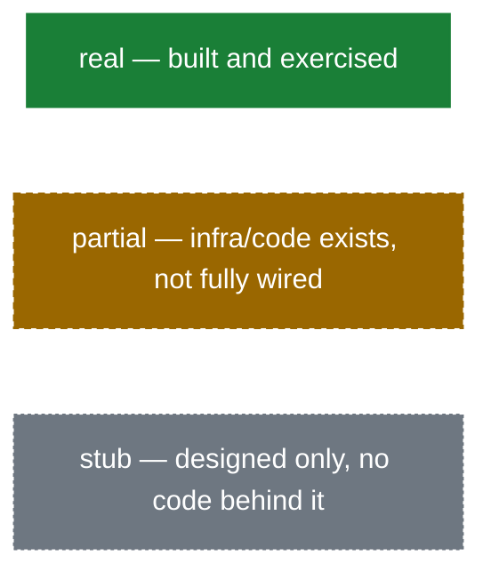

# Agent Factory — Architecture Documentation (C4 + status)

This directory **supplements** the two root design docs — it does not replace
them and does not re-derive their rationale:

- [`agent-factory-architecture.md`](../agent-factory-architecture.md) — the
  8-layer factory design, why each building block was picked (buy vs.
  assemble-only per layer, §1–§4).
- [`agent-swe-design.md`](../agent-swe-design.md) — one factory output in
  full: the `swe-agent` spec (scope, triggers, tool access, workflow,
  guardrails, eval criteria, failure handling).

Read those two first for *why*. Read this directory for *what actually
exists today, as diagrams* — and what's left to wire. Every page here links
back to a `§N.M` section instead of re-explaining it.

## Reading order

| # | File | Answers |
|---|---|---|
| 1 | [`00-status.md`](./00-status.md) | Per-layer: designed vs. actual, with file-cited evidence. The reference table every diagram below draws its status coloring from. |
| 2 | [`10-c4-context.md`](./10-c4-context.md) | C4 **Level 1 — Context**: who/what talks to the factory from outside. |
| 3 | [`20-c4-container.md`](./20-c4-container.md) | C4 **Level 2 — Containers**: the 8 layers, as designed *and* as built. |
| 4 | [`30-c4-component-swe-agent.md`](./30-c4-component-swe-agent.md) | C4 **Level 3 — Components**: inside the one real container, `harness/swe-agent`. |
| 5 | [`40-sequence-swe-agent-runtime.md`](./40-sequence-swe-agent-runtime.md) | Runtime trace of a real `swe-agent` run, and what's missing vs. its own design doc. |
| 6 | [`50-pipeline-flow-gap-analysis.md`](./50-pipeline-flow-gap-analysis.md) | The factory's own §2 process flow, status-colored end to end. |
| 7 | [`60-best-practices.md`](./60-best-practices.md) | Per-layer "definition of done" checklists, conventions to replicate, open risks. |
| 8 | [`70-multi-agent-pipeline-design.md`](./70-multi-agent-pipeline-design.md) | **Design proposal, not built.** Extends `AgentPipelineWorkflow` into a full multi-stage SDLC pipeline — PM review, architect judge-panel, quality gate, automated/security review, human approval gates. |

No C4 **Level 4 (Code)** page — out of scope at this codebase's current
size; the one container worth decomposing that far (`swe-agent`) is fully
covered at Level 3.

## Conventions used across this directory

**Status legend** (applied via Mermaid `classDef` in every diagram below):

**C4 stereotypes** are written as `<<Person>>`, `<<System>>`, `<<Container>>`,
`<<Component>>` labels inside plain Mermaid `flowchart` nodes rather than
native `C4Context`/`C4Container` syntax — this matches the `flowchart TD`
idiom the two root docs already use (their §2 and §5 diagrams), and renders
reliably on GitHub, in editor Markdown previews, and in Mermaid Live, where
native C4 diagram support is inconsistent.

**Note on staleness:** this directory is a snapshot, re-verified against
source at each documentation pass — not on every commit. As of the pass
that wired the real Temporal Build→Gate→Register loop and the
`RegistryPromotionWaiterWorkflow` (commit `52e5366`), all pages reflect it;
see `00-status.md`'s cross-cutting facts and `60-best-practices.md` §3 for
the fastest way to check what might already be stale again — Deploy
(`promote_agent_activity`) being unreachable and the GitHub-comment
trigger path having no Gate/Register/Deploy step are the two facts most
likely to change next.
