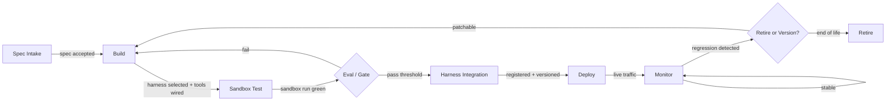

# Agent Factory Architecture

## 1. Definitions & Outcome Spec

### 1.1 What "agent factory" means

This document describes two tiers, not one, and the rest of the doc is scoped to the first:

- **The agent factory (this doc's subject).** A system that turns an agent specification into a deployed, monitored, versioned *agent worker* — repeatably, for many agent workers, without a human re-wiring the pipeline each time. The unit of output at this tier is not "an answer" but a *running agent* (`swe-agent`, `pm-agent`, and the planned `architect-agent`) with an identity, a version, a rollback path, and eval evidence attached to it. §§1.2–3.8 below are entirely about this tier — building and shipping the workers.
- **The SDLC pipeline (the factory's product, one level up).** Those agent workers don't sit idle once shipped — they run inside a separate, higher-level pipeline (`docs/70-multi-agent-pipeline-design.md`) that takes a spec through PM review, architecture, build, quality gate, automated review, and security review, entirely via a GitHub App/webhook control plane. *That* pipeline's unit of output is a **merged pull request — a shipped code change in a target repo** — not a deployed agent. The agent factory is this pipeline's foundation, not its product: it's how the PM-agent, architect-agent, and swe-agent workers the pipeline calls at each stage get built and versioned in the first place.

Conflating the two produces a real bug, not just a naming issue: `AgentPipelineWorkflow` today ends every run in `register_activity`, writing `registry/agents/<agent_name>/manifest.yaml` — the agent-factory tier's terminus, grafted onto a run whose actual work is the SDLC-pipeline tier's (building one feature in one target repo). The registry should version the agent *workers* (`swe-agent`, `pm-agent`, `architect-agent`), not the *features* those workers happen to ship — `register_activity`'s current call site is a known mismatch, not yet fixed in code (tracked alongside `specs/005-pipeline-mode-signals-escalation`).

The agent factory, in isolation, is explicitly **not**:
- **A single agent.** One Claude Agent SDK (software development kit) app with a system prompt and some tools is a product, not a factory. A factory is the thing that built it, tested it, and can build the next fifty like it.
- **A multi-agent framework.** LangGraph, CrewAI, and the Claude Agent SDK are *harness/runtime* components (§3.2) — they define how one agent (or a graph of agents) executes. A factory sits a level above: it decides which harness a spec compiles to, runs the harness in a sandbox, gates it through evals, and ships it. A framework has no opinion on intake, gating, or retirement; a factory must.
- **An internal dev tool / script collection.** A folder of prompt templates and a deploy script is *assemble-only* infrastructure with no lifecycle guarantees — no registry, no eval gate, no rollback. It becomes a factory only once those guarantees are enforced structurally, not by convention.

`[PDF]` The source landscape brief maps a different but related question — which *product-market* layers of an agentic **platform** (the substrate agents run on) are buyable today. An agent factory is the pipeline that *builds and ships* agents onto that platform; it consumes several of those platform layers as building blocks. §1.3 below reconciles the two vocabularies explicitly so they are never blended.

### 1.2 Component taxonomy (fixed vocabulary)

`[Assumption]` These eight layer names are introduced for this document because no existing taxonomy names a build-and-ship pipeline for agents; the PDF's 13 layers describe the platform agents run *on*, not the factory that produces them. Once defined here, no synonyms are used for these terms elsewhere in the document.

| Layer | Definition |
|---|---|
| **Spec/Intake** | How a human or system expresses "build me an agent that does X" as a structured artifact — scope, tools, success criteria, owner. |
| **Harness/Runtime** | The framework an agent's logic executes inside — the agent loop, tool-calling contract, memory/state handling. |
| **Execution Sandbox** | The isolated compute environment where a candidate agent runs code, calls tools, and is tested, without touching production systems or the host. |
| **Inference Routing** | The layer that resolves a model call to a specific provider/model, handling failover, cost routing, and key management. |
| **Orchestration/Durable Execution** | The engine that sequences multi-step, long-running, retryable work across the pipeline (and across an agent's own multi-step tasks) with crash-safe state. |
| **Eval/Gating** | Automated and human checkpoints that decide whether a candidate agent is good enough to promote to the next stage. |
| **Deployment/Lifecycle** | How an agent goes live, gets an identity and version, is rolled back, and is eventually retired. |
| **Observability** | Traces, logs, and metrics emitted by agents in sandbox and in production, feeding both debugging and the eval layer. |

### 1.3 Crosswalk to the PDF's platform-layer taxonomy

`[PDF]` The source brief's reference model has 13 layers (Connectors, Interaction, Interaction Intelligence, Governance, Orchestration, Agentic Workforce, Guardrails, Tools & Integrations, Execution Substrate, Model Gateway, Workflow & Skill Catalog, Context Layer, Context Distribution) plus a crosscutting Observability & Evals category, and rates each as **Buy**, **Emerging**, or **Assemble-only**.

| Factory layer (this doc) | Nearest PDF layer(s) | PDF verdict |
|---|---|---|
| Spec/Intake | 3 — Interaction Intelligence | `[PDF]` Assemble-only — "nobody sells business intent/urgency triage" |
| Harness/Runtime | 6 — Agentic Workforce | `[PDF]` Buy — "crowded and extremely well funded" |
| Execution Sandbox | 9 — Execution Substrate | `[PDF]` Buy |
| Inference Routing | 10 — Model Gateway | `[PDF]` Buy, commoditised |
| Orchestration/Durable Execution | 5 — Orchestration | `[PDF]` Buy — "the most mature layer in the stack" |
| Eval/Gating | Crosscutting Observability & Evals; 4 — Governance (approvals) | `[PDF]` Buy (evals); Emerging (governance) |
| Deployment/Lifecycle | 4 — Governance; parts of 11 — Workflow & Skill Catalog | `[PDF]` Emerging (governance pieces mature, whole is DIY); Assemble-only (catalog) |
| Observability | Crosscutting Observability & Evals | `[PDF]` Buy — "never build this" |

This crosswalk produces the document's central claim: **the factory's two ends — spec intake and the deployment/lifecycle registry — sit on exactly the PDF's assemble-only layers, while the middle of the pipeline is buyable.** `[PDF]` "The assemble-only layers are also the differentiating ones... they encode how your organisation decides, works and knows." That is not incidental — a factory's competitive value lives in the parts nobody can buy: how it decides what to build (intake/triage) and how it governs what it has built (the registry, the skill catalog). The buyable middle (orchestration, sandboxing, model routing, harness, evals) should be bought, because building it yourself only recreates a commodity at greater cost and slower iteration.

The same claim holds one tier up, at the SDLC pipeline (§1.1) this factory is the foundation for. There, the differentiating, assemble-only layer isn't intake or a registry — it's the **gate chain**: PM's value-judgment writeup, the architect fan-out-and-judge panel, the quality gate, and the security-clearance sign-off (`docs/70-multi-agent-pipeline-design.md` §2, §4). Nobody sells "is this PR ready to ship" any more than the PDF's layer 3 sells intent/urgency triage — it's the same assemble-only shape, restated at the pipeline's own promotion boundary instead of the factory's. The GitHub-comment control plane (`orchestration/webhook_bridge/`, §3.1 below) that carries every one of those gate decisions is the pipeline's other differentiating piece, for the same reason spec intake is this doc's: it's where an organisation's own judgment enters the system.

### 1.4 Outcome specification

A working agent factory produces **deployed, versioned agents that pass a defined quality bar, at a knowable cost, faster over time as components are reused.** Success is measured by:

- **Spec-to-deployed lead time.** Wall-clock from an accepted spec to a promoted, live agent. Rationale: this is the factory's basic throughput metric — if it isn't faster than a human hand-building one agent, the factory has no reason to exist.
- **Eval pass rate at the promotion gate.** Share of candidates that clear Eval/Gating on the first pass vs. requiring rework. Rationale: `[PDF]` evals are the one crosscutting layer the brief says to "buy, never build" — treating the gate as instrumented and mandatory, not advisory, is what separates a factory from ad hoc shipping.
- **Share of agent definitions held in portable formats.** Percentage of shipped agents whose skill/tool/prompt definitions live in open formats (SKILL.md, MCP — Model Context Protocol, the open standard for wiring tools into agents — manifests) rather than a vendor-proprietary registry. Rationale: `[PDF]` "keep the accumulating layers... in formats you own" — the registry and skill catalog are the layers the PDF shows nobody exports; this metric tracks whether the factory is quietly accumulating vendor lock-in at its most valuable layer.
- **Cost per agent-run.** `[PDF]` anchored against sandbox pricing (~$0.05/vCPU-hour) and action-metered platform pricing (~$0.10/action on Salesforce Flex Credits) as external reference points, so a factory-produced agent's run cost can be sanity-checked against buy-side alternatives.
- **Component reuse rate.** Share of a new agent's harness/tool/skill components pulled from the existing catalog vs. built fresh. Rationale: this is the factory's compounding-return metric — it should rise release over release, or the factory is not actually a factory, just a slower way to hand-write agents.
- **Rollback / retirement latency.** Time to pull a bad agent version from production and time to fully retire an unused one. Rationale: `[PDF]` this whole layer is assemble-only everywhere, so it gets no vendor SLA (service-level agreement) by default — the factory must instrument it itself or it will not know this number until an incident forces the question.

The six metrics above are all foundation-tier — they measure the factory that builds agent workers. The SDLC pipeline those workers run inside (§1.1) has its own, distinct success measures, since its unit of output is a merged PR, not a deployed agent:

- **Spec-to-merged-PR lead time.** Wall-clock from an accepted `specs/NNN-slug/spec.md` to a human-merged target-repo PR. This is the pipeline's throughput metric, parallel to the foundation tier's spec-to-deployed-agent lead time above, but measured at the feature level.
- **Per-stage gate pass rate.** Share of runs that clear each blocking gate (PM Spec-Review, Plan-Review, Quality-Gate, Security-Review) on the first attempt vs. requiring a human-rejected retry — per `docs/70-multi-agent-pipeline-design.md` §4's contract table.
- **Human corrections per run.** Count of human `*_rejected` signals (PM, plan, security) plus blocking automated-review findings across one pipeline run. `docs/70` §10's fully-worked walkthrough hits five corrections in one `full`-mode run — that's a concrete current baseline to track against, not a target to hit.

## 2. Process Flow

**Spec intake → Build.** A spec (goal, tools, guardrails, owner, success criteria) is accepted by an intake gate — human review or a triage rule — and handed to build tooling that assembles a harness config, tool bindings, and initial skill set. `[Assumption]` This gate is where an organisation's own judgment about *what's worth building* lives; the PDF's layer-3 gap (no vendor sells this) means it is necessarily bespoke.

**Build → Sandbox Test.** The assembled agent runs inside an isolated sandbox (§3.3) against test tasks and adversarial inputs, with no access to production credentials or data. `[PDF]` This is where the "Buy" verdict on Execution Substrate applies directly — E2B, Modal, and peers exist precisely so this step doesn't require self-hosted microVM infrastructure.

**Sandbox Test → Eval/Gate.** Traces from the sandbox run feed an eval harness that scores against the spec's success criteria; a failing score routes back to Build with the failure attached (not a bare "fail" — the loop needs the eval trace to be actionable). A passing score proceeds. `[Research]` Braintrust explicitly implements this as a CI (continuous integration)-style rejection gate; LangSmith and Phoenix leave the promotion policy to the caller, which is a decision the factory must make itself rather than assume the tool makes it.

**Eval/Gate → Harness Integration.** The passing agent is registered — given an identity, a version number, and its skill/tool manifests committed to the catalog — before it is wired into the production harness/runtime. This is the deployment/lifecycle layer's entry point (§3.7), and it is where the PDF's governance gap (layer 4, "pieces mature, whole is DIY") becomes concrete: no single vendor issues identity + registry + audit for a bespoke pipeline the way Microsoft Agent 365 does for its own ecosystem.

**Harness Integration → Deploy.** The registered agent version is promoted to serve real requests, typically behind a canary or staged rollout so Monitor can catch regressions before full traffic.

**Deploy → Monitor.** Live traces, cost, and outcome signals stream to the observability layer (§3.8) continuously.

**Monitor → Retire or Version.** A regression or a scheduled review triggers a decision gate: patch and re-enter Build with a new version, or retire the agent and deregister it. `[Assumption]` This decision gate is the one the PDF shows the least tooling for anywhere in the market — the graveyard section notes even vendor-run agent products (OpenAI's Agent Builder) get retired abruptly, so the factory's own retirement path cannot assume graceful vendor support.

## 3. Architecture by Layer

Each Phase 2 process step maps to one layer below and the building block chosen for it:

| Process step (§2) | Factory layer | Chosen block |
|---|---|---|
| Spec Intake | Spec/Intake (§3.1) | GitHub App (transport + touchpoint + approval, via `orchestration/webhook_bridge/`) + GitHub Spec Kit (schema/triage) — supersedes this doc's original Composio/Nango + Slack/Teams + HumanLayer/gotoHuman choice |
| Build | Harness/Runtime (§3.2) | Claude Agent SDK |
| Sandbox Test | Execution Sandbox (§3.3) | E2B |
| (every model call, throughout) | Inference Routing (§3.4) | LiteLLM (self-hosted) |
| (pipeline + agent task sequencing, throughout) | Orchestration/Durable Execution (§3.5) | Temporal |
| Eval/Gate | Eval/Gating (§3.6) | Braintrust + Langfuse |
| Harness Integration, Deploy, Retire/Version | Deployment/Lifecycle (§3.7) | Git-backed registry (UiPath/Microsoft/AgentCore pattern) |
| Monitor | Observability (§3.8) | Langfuse |

### 3.1 Spec/Intake

**Purpose:** Convert an unstructured request ("we need an agent for X") into a structured, versioned spec the rest of the pipeline can act on deterministically. This layer spans three PDF layers, not one, and each has a different verdict.

**Superseded design, current reality:** the original three-vendor split below (Composio/Nango transport + Slack/Teams touchpoint + HumanLayer/gotoHuman approval) was this doc's first-pass answer, before this repo had a real intake surface. It never shipped, and it isn't the plan anymore — `docs/00-status.md` already marks it "Superseded." What's actually built collapses transport, touchpoint, *and* approval into one building block: a **GitHub App**, acting as a persistent webhook subscriber (`orchestration/webhook_bridge/`, `docs/70-multi-agent-pipeline-design.md` §1.1) rather than a CI-triggered script. A raw request arrives as a GitHub issue or PR comment (transport = touchpoint, no separate chat surface needed); every human sign-off in the pipeline — spec acceptance, plan approval, security clearance — is a PR comment the same App parses and turns into a Temporal signal (approval, same channel). The three-vendor split the paragraphs below describe is kept only as a record of the reasoning that was superseded, not as the current chosen block — see the mapping table above for what's actually wired.

**Chosen building blocks — three parts (superseded, see above):**

- **Transport (buyable):** `[PDF]` Layer 1, Connectors, is rated "Buy the transport, build the schema" — Composio, Nango, Merge.dev, Paragon, Airbyte, Hookdeck, and Svix are named as mature options for getting a request (a ticket, a form submission, a webhook) into the factory. Composio is the reference pick here specifically because it also appears in the PDF's Tools & Integrations registry (layer 8), so the same connector layer that brings a spec in can later expose the finished agent's tools out — one less integration to maintain.
- **Touchpoint (emerging, buyable):** `[PDF]` Layer 2, Interaction, is "Emerging" — Slack/Teams-native surfaces are named as mature enough to use today. The reference design puts spec submission in the requester's existing chat surface (Slack or Teams) rather than a bespoke intake form, and routes the acceptance decision through HumanLayer or gotoHuman — both `[PDF]`-named for "approval touchpoints" — so a human sign-off on the spec is a first-class, auditable step rather than an informal Slack thread.
- **Schema + triage (assemble-only, still current):** `[PDF]` Layer 3, Interaction Intelligence, is assemble-only market-wide — "intent/urgency triage is fine-tune-it-yourself," and even the best-positioned vendor (ServiceNow, via its Moveworks acquisition) sells triage only as part of a locked-in suite, not standalone. No product decides *whether this spec is worth building*. This half of the original design held up: GitHub Spec Kit (`.specify/` + `specs/NNN-slug/`) is exactly this structured template (goal, inputs/outputs, tools, guardrails, acceptance tests) stored as a spec file in the same repository as the agent's skill definitions, with `swe-agent`'s `verify_spec_exists()` enforcing the accept/escalate rule at runtime instead of leaving it to reviewer judgment.

**Rationale:** Why the transport/touchpoint half changed: a GitHub App wins on the same "buy the transport, don't build a bespoke one" logic the PDF applies to Composio/Nango — except here the "vendor" is GitHub itself, already the system of record for the issues/PRs this pipeline acts on, so routing intake and every approval through it needs no second integration surface at all. Schema/triage is still where an organisation's own judgment lives, and per §1.3 this is the layer both the foundation tier and the SDLC-pipeline tier treat as differentiating rather than commoditized.

**Inputs/Outputs:** Input: a raw request arriving via the GitHub App (issue, PR comment). Output: a structured, triaged spec artifact (`specs/NNN-slug/spec.md`) consumed by Build.

### 3.2 Harness/Runtime

**Purpose:** Execute the agent's reasoning loop — plan, call tools, observe results, continue — against a defined contract.

**Chosen building block: Claude Agent SDK.** `[PDF]` It is "the most portable of the big three: MIT-licensed, runs on your infrastructure, skills are plain markdown" — directly supporting the portability metric in §1.4. `[Research]` Competing harnesses are viable but trade portability for something else: LangGraph adds graph-based checkpointing and time-travel debugging (high production adoption, ~51.8k GitHub stars as of mid-2026); CrewAI reports the largest raw execution-volume claims of the cohort, though `[PDF]` the source brief cautions specifically against reading that as commercial depth — "note the gap between Fortune 500 usage claims and modest estimated commercial ARR (annual recurring revenue): adoption is mostly the free framework"; Google's ADK (Agent Development Kit, general availability April 2026) offers multi-language support with enterprise governance built in. The last two are more opinionated about deployment topology than the Agent SDK, which works against a factory that wants to swap the sandbox or gateway underneath without rewriting the harness layer.

**Rationale:** A factory should be able to change model providers, sandbox vendors, and orchestration engines independently of the harness. An MIT-licensed, markdown-skill-based harness keeps that layer's exit cost low, consistent with the PDF's broader point that swappable layers should be accepted cheaply from a vendor while accumulating assets (skills, in this case) stay in an owned format.

**Inputs/Outputs:** Input: spec + assembled tool bindings. Output: an executable agent instance ready for sandbox testing.

### 3.3 Execution Sandbox

**Purpose:** Run an untrusted or unvalidated agent's tool calls and code execution in isolation, both during Sandbox Test and (for computer-use agents) in production.

**Chosen building block: E2B.** `[PDF]` Firecracker microVMs at ~150ms startup, contrasted directly against Daytona's ~90ms startup on weaker Docker-level isolation. `[Research]` This is corroborated independently: E2B reports Firecracker microVM isolation with high enterprise adoption; Cloudflare Sandboxes (GA April 2026) and Vercel Sandbox (GA January 2026, also Firecracker, sub-1-second start) are newer entrants competing on edge distribution and cold-start latency respectively; Modal targets GPU-backed sandboxes for workloads needing accelerators.

**Rationale:** For a factory running untrusted, freshly-built agent code repeatedly through a gate, isolation strength dominates the trade-off — a sandbox escape at this stage compromises the pipeline, not just one session. The PDF's isolation-vs-speed framing (Daytona faster but weaker) is the deciding fact; E2B's microVM boundary is preferred over shaving startup latency. `[PDF]` The graveyard pattern — "assume any single-Series-A vendor in this space is an acquisition target" — still applies to E2B; revisit this pick if its funding or roadmap status changes.

**Inputs/Outputs:** Input: an assembled agent instance + test/adversarial task set. Output: execution traces and pass/fail signal for Eval/Gate.

### 3.4 Inference Routing

**Purpose:** Resolve each model call to a provider, handle failover between providers, and give the factory one place to enforce cost and key policy.

**Chosen building block: LiteLLM (self-hosted).** `[PDF]` The layer is explicitly "commoditised" — LiteLLM, Portkey, OpenRouter, Kong AI Gateway, and Cloudflare AI Gateway are functionally close substitutes. `[Research]` LiteLLM's differentiator is that it runs as a self-hosted proxy behind one OpenAI-compatible endpoint, keeping routing logic and provider keys inside the factory's own infrastructure, versus Portkey (managed, adds hosted observability/guardrails) or OpenRouter (fully hosted aggregator, zero ops but no data-residency control).

**Rationale:** Given a commoditised layer, the deciding factor is exit cost and data residency, not feature depth — a self-hosted gateway means switching model providers never requires switching the gateway vendor too. A factory that also buys a managed gateway for its observability features (Portkey) is a reasonable alternative if the organisation already accepts vendor lock-in on observability elsewhere.

**Inputs/Outputs:** Input: a model call from the harness (prompt, tool schema, target capability). Output: a routed response, with cost and latency metadata sent to Observability.

### 3.5 Orchestration/Durable Execution

**Purpose:** Sequence the factory's own multi-stage pipeline (intake → build → test → gate → deploy) and an individual agent's long-running, multi-step tasks, with crash-safe, replayable state — so a failed step resumes rather than restarts.

**Chosen building block: Temporal.** `[PDF]` "The most mature layer in the stack," backed by a $300M Series D at a $5B valuation (February 2026) explicitly positioned on agentic AI. `[Research]` This is corroborated: Temporal now offers serverless workers and multi-cloud support; alternatives (Inngest for event-driven workflows with low migration friction, Restate for durable stateful objects without a separate orchestration engine, Trigger.dev/Hatchet for finer-grained AI task concurrency) are credible but occupy narrower niches.

**Rationale:** Both the factory's pipeline and the agents it produces need the same property — deterministic replay after failure — so standardizing on one durable-execution engine for both avoids running two orchestration systems. Temporal's maturity and current capital position reduce the graveyard risk the PDF flags as a first-order selection criterion.

**Inputs/Outputs:** Input: pipeline stage transitions and agent task steps. Output: durable state checkpoints; retry/resume signals to any stage.

### 3.6 Eval/Gating

**Purpose:** Score a candidate agent against the spec's acceptance criteria and block promotion until it clears a threshold; also score live agents on an ongoing basis to catch drift.

**Chosen building block: Braintrust for the gate; Langfuse for trace storage.** `[Research]` Braintrust is the one tool among the surveyed set that treats CI-style rejection as core behavior — it will reject a promotion on eval regression rather than leaving that policy to the caller, which LangSmith and Arize Phoenix both do. Langfuse (now part of ClickHouse as of early 2026) is a credible open-source trace store to sit underneath it. `[PDF]` This whole crosscutting layer is rated "Buy — never build this," so the recommendation is a buy decision on both ends.

**Rationale:** A gate that isn't enforced automatically is not a gate — it's a suggestion a busy team will skip under deadline pressure. Braintrust's default posture (block on regression) matches what §1.4's promotion-gate metric assumes. `[Research]` Human-in-the-loop approval tools (HumanLayer, gotoHuman) sit alongside this for the subset of promotions requiring a human sign-off — 95.5% of organisations reportedly required human-in-the-loop gating after some AI incident as of 2026, per one survey `[Research, medium confidence — single-source stat]`.

**Inputs/Outputs:** Input: sandbox execution traces + acceptance criteria from the spec. Output: pass/fail decision to Harness Integration; ongoing production scores to Monitor.

### 3.7 Deployment/Lifecycle

**Purpose:** Give every shipped agent an identity, a version, a rollback path, and eventually a retirement path — the factory's own agent registry.

**Chosen building block: none exists to buy; the pattern is assembled.** `[PDF]` This is explicitly the assemble-only end of the spectrum for anyone not fully inside one vendor's ecosystem: layer 11 (Workflow & Skill Catalog) has "no versioned, permissioned catalog product... git + CI is the state of the art," and layer 4 (Governance) is "pieces mature, whole is DIY." The closest *shape* to copy, not buy, comes from two suite vendors: UiPath Maestro's Agent Registry (version/pause/rollback as first-class registry operations) and Microsoft Agent 365 (every agent gets an identity, registry entry, audit trail, and org-chart placement) — both cited by the PDF as the strongest governance stories in the market, but both locked to their respective platforms. `[Research]` AWS Bedrock AgentCore's Agent Registry (centralized catalog for agents/tools/MCP servers, cross-account sharing) is a third pattern reference, notable for being framework-agnostic rather than tied to one harness.

**Rationale:** The reference implementation is a git-backed catalog of agent manifests (SKILL.md-format skill definitions, MCP tool manifests, a version tag, an owner) with CI enforcing that no agent reaches Deploy without a registry entry — copying the *operations* (version, pause, rollback) that UiPath and Microsoft productize, without adopting their lock-in. This is the layer where the portability metric in §1.4 is won or lost: every agent definition kept in SKILL.md/MCP format here is one the factory can move off any given harness or platform later.

**Inputs/Outputs:** Input: a gate-passed agent version. Output: a registered, identified, versioned agent live in production, discoverable by the registry; a deregistration event on retirement.

### 3.8 Observability

**Purpose:** Capture traces, costs, and outcomes from every sandbox run and every production agent, feeding both human debugging and the Eval/Gating layer's ongoing scoring.

**Chosen building block: Langfuse.** `[PDF]` The crosscutting Observability & Evals layer is rated "Buy — never build this," alongside LangSmith, Braintrust, and Arize Phoenix as the named options. `[Research]` Langfuse's post-ClickHouse backing and open-source self-host option keep trace data in an owned data store, consistent with the portability posture taken elsewhere in this architecture; Phoenix's OpenTelemetry-native format is a credible alternative if the organisation already standardizes on OTel.

**Rationale:** Trace data is a factory-level asset — it is what powers the reuse-rate and cost-per-run metrics in §1.4 — so it should be centrally captured rather than left inside whichever tool happens to run each stage. Buying this layer, per the PDF's explicit instruction, avoids the common failure mode of building a bespoke logging pipeline that never gets the query and alerting tooling a dedicated product ships by default.

**Inputs/Outputs:** Input: execution traces from Sandbox, Eval/Gate, and production Monitor. Output: dashboards, cost/latency metrics, and eval-score feeds back into the Eval/Gating threshold.

## 4. Open Questions / Assumptions Log

- `[Assumption]` The eight-layer factory taxonomy (§1.2) is introduced for this document; no market taxonomy names a build-and-ship pipeline for agents distinct from the platform layers they run on.
- `[Assumption]` The Spec/Intake gate is described as a template + human/rule review; no product-level tooling for this was found either in the PDF or in Phase 2 research, so the actual triage logic (what auto-approves vs. escalates) is left unspecified and would need to be defined per organisation.
- `[Assumption]` Deployment/Lifecycle is described as an assembled git-backed catalog rather than a named product, because none of the sources — PDF or Phase 2 research — identified a standalone, framework-agnostic registry product outside a locked suite (Microsoft, ServiceNow, UiPath) or a single-cloud service (AWS AgentCore).
- `[Research, single-source]` The "95.5% of organisations require human-in-the-loop gating" statistic (§3.6) comes from one 2026 survey (AvePoint) surfaced by a Haiku research pass and was not cross-verified against a second source.
- `[Research, medium confidence]` Specific 2026 GA dates and version numbers for Cloudflare Sandboxes, Vercel Sandbox, LangGraph v1.2, and Google ADK v1.0 come from Phase 2 web research on a fast-moving market and were not independently re-verified against primary vendor changelogs at time of writing.
- `[PDF]` All pricing anchors (E2B/Daytona latency figures, ~$0.05/vCPU-hour, Salesforce ~$0.10/action, Temporal's $5B valuation) are as reported in the source brief as of 17 August 2026; the brief itself flags third-party pricing for sales-led vendors as estimates, not quotes.
- `[Assumption]` This architecture assumes a factory serving one organisation building agents for internal or product use, not a multi-tenant SaaS offering agent-building as a service — the registry and governance design would differ materially in the latter case.
